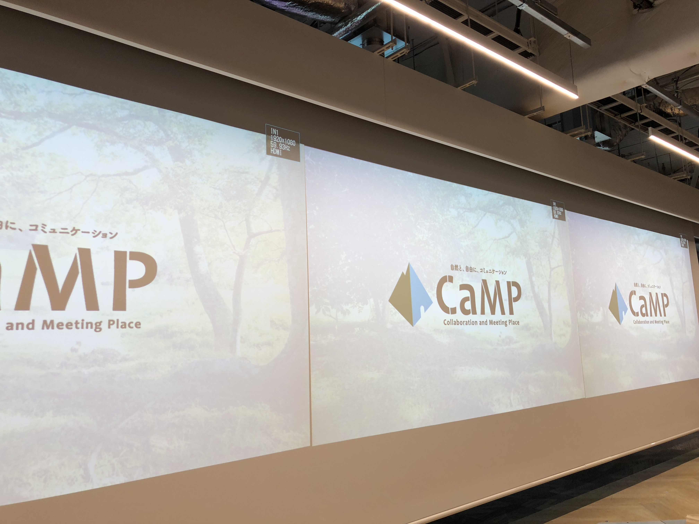
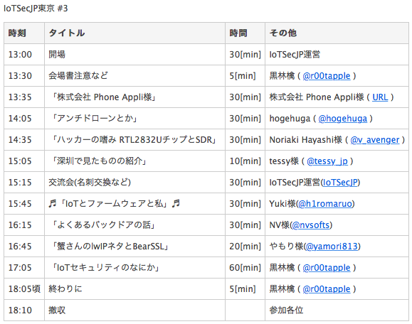

# IoTSecJP Tokyo #3に参加してきました

こんにちわ。現在まだ就活中のひみつ(tokina)です。

１ヶ月程度も遅くなってしまいましたが、2018/04/28にIoTSecJP Tokyo #3に参加し、お話を聞かせて頂きました。抽選にパスして良かったです。今年の１月から４ヶ月程度経過しましたね。折角メモをとっていたので、記事として残しておきたいと思います。

https://iotsecjp.connpass.com

http://ruffnex.net/iotsecjp/

また、4/22には秋葉原UDXにて技術書展が開催され、そちらも参加させて頂きました。IoTSecJPの技術書は非常に人気で、開始１時間弱で完売してしまったため、私はPDF版を購入しました。こちらの感想も簡単に書きたいと思います。

今回、一番の注目ワードは私としては「ドローン」でした。ドローンの使用例が増加している今、セキュリティとしての視点「アンチドローン」が必要なのではないでしょうか。

覚えている範囲で感想などを書いていきたいと思います。

とかなんとか書いてる間に名古屋もありましたね！！

当日のスケジュールはこんな感じでした。

## 1. Phone Aplliさん

https://phoneappli.net

### Phone Aplliさんが提供しているweb電話帳についての説明

某大手様において、活用されているとのこと。　　　　　　　　　　　　　　　

その他コミュニケーションツール（Slack、Skype など）と連携できる→ベンチャーのような会社から大手にも対応できる！

誰がどこにいるか知ることが出来るIoTのシステムとの連携も可能らしい。

現在は大手が取引相手で悩んでいるらしい

**本当は比較的小規模な会社様にももっと利用してほしいらしいです。**

### snow peak * Phone Appli

Phone Appliさんおオフィスは「気持ちのよい自然の香り」が漂っていました。自然を意識して、気持ちよく働ける環境づくりを。

＋会社に来なくてもクオリティの高いコミュニケーションを（在宅でも！）

### weekly 1 on 1ブース

上司など、1対1でミーティングしたいとき、ありませんか？そんなときに無音で会話できるスペースです。

現在、村田製作所さんと共同で実証実験中らしい。

部下のメンタルヘルス、コミュニケーション　→　ボックス中の会話などを可視化

自動的にこうした会話情報を収集、管理できるようです。

### その他

- Personal work 集中スペース

    ダイエット椅子、集中できるメガネなどを用意。個人が集中できるスペースを提供。

- Apple watch全社員貸与

    社員の健康管理、意識向上　一人３万円なら逆に安いのでは？

## 2. hogehugaさん「アンチドローンの話」

http://www.security-feed.club/other/iotsecjp3/

hogehugaさんは普段から様々なニュースを提供してくれているので、いつも参考にさせていただいています。この前の技術書典で出版したIoTSecJP本でもアンチドローンについて解説されていました。

### アンチドローンとは

リスクについては航空防衛コンサルティングファーム　CARCIEL Inc.などを参考に。

「スパイ、密売、攻撃、衝突」こうした目的を**防ぐ**こと。

### ドローンの利活用例

もちろんドローンは不正利用ばかりではなく、うまく利用すれば必ず社会に貢献するはずですよね。

- 建設

    地図を指定したら自動で空中から撮影

    自立飛行しながら建設現場の3Dモデルを作成してくれるらしい

    応用すれば自動で農薬を巻くこともできる！さらに赤外線カメラで必要な農薬を

- 郵便

    宅配実験した例があるがすぐに衝突したらしい

- 軍事利用

    偵察、爆撃、、、かつての兵器より非常にコストが小さくできるが、、

- これらが妨害されると？？

    多くの面で”妨害”によって不利益を被ることが明らか→アンチドローンが必要

### どんな機能が？

- 各種センサで自立飛行

    画像センサ、赤外線センサ、気圧センサ、GPS　→　ホバリング、３次元的な固定

### ドローンとの通信

ドローンとの通信は特定の周波数を利用しています。

テレメトリ系と制御系は帯域が別の可能性がある（ここはそれぞれの対応仕様を解析してみないとわからないですね）

通信の内容自体は案外JSONかもしれない？

トイドローンを解析してみよう！

#### 通信の妨害？

- 通信経路

    簡単に電波遮断すれば通信できないよね（法的にはアウトかもしれないけど）

    特定のCHのみ無効にもできるよね

- 物理的妨害

    超音波を当てるとジャイロセンサが狂っておかしくなる（BlackHat2017）

    加速度センサが誤作動するとか、、

    画像認識を妨害っていうのも考えられるはず

- ドローン自体への攻撃

    USBデバッグして何かしらを仕込む

    DJIでAndroidを利用しているものもある

個人的にドローンで遊んでみたいと思っていたので、今後お金が貯まれば購入して遊んでみたいと思います。

## 3. Noriaki Hayashiさん「ハッカーの嗜み RTL2832チップとSDR」

SDR; Software Defined Radio

OSSで提供されているらしい！

KaliLinuxにもSDRのソフトが沢山入っている→ホットトピックらしい

しかしKaliでも使いづらいとか

### FMラジオも聞けるワンセグチューナーにもなる「REALTEKさんのチップ　RTL2832」

無線のELLO WORLDはFMラジオ

（がんばれば）テレビも見れます

受信状況を確認するスペクトラム・アナライザにも

### SIGINT; 飛行機の機内にてADS-B信号の受信をやってみた

専用のソフトウェアを利用すれば航空情報を拾うことが出来る

ADS-Bの信号を解析をしてみれば？

高度・緯度・経度などを見れる

- 受動的な攻撃

ないすまし、偽装攻撃

### 行き過ぎた信頼関係があるのでは？

CANもそうだし、もともと攻撃などを想定してない性善説で成り立ってしまっているのでは？

### おあそび

信号機の信号をハック、トイドローンも

### HackRF

ちょっと前からたまに聞くやつですね。無線テスト用途のやつです。

私も最近LoRaWAN（920MHz帯）について調べていたので、HackRFについても目にすることがありました。

ちょっとたかいかも？

### NFC/RFID なら　Proxmark3

最近ホテルのカードキーを複製した人がいましたね、、

日本のホテルのホテルキーだと簡単に。。。？

どうやら部屋番号×入室時間で一意に識別してるらしい？それって宿泊者が複数いる場合にやばいのでは、、、？

### 参考書籍

Inside Radio An attack and Defense Guide

## 4. tessyさん「深圳にいったはなし」

中国のシリコンバレーと呼ばれてるシンセンに行ってきたそうです。

新規開発、ハードウェアスタートアップ支援なども充実してるらしい！（いきたい）

### キャッシュレス社会

そもそも、中国ではすでに現在「街中どこでもQRコードで支払い」とのこと。噂には聞いていましたが、、

中国人の友人も、日本ではできるだけカード支払いで済ませたいと言っていたのを思い出しました。

日本みたいにチャージ方式もできるけど、基本的には銀行からの引き落としらしいです。

さらには個人間でのやりとりも！

日本だとLINE Payのような感じでしょうか？現金主義もほどほどまでに、クレジットカードをうまく活用していきたいこの頃です。

### ジャンクショップ

マイニング、ASIC機も普通にうってた　ANT MINER

あやしいスマートカメラなどなど

これも行ってみたい、、、

## 5. Yukiさん「IoTとファームウェアと私」

資料は後から展開してくれるらしい！　←　@h1romaruoさんのアカウントをチェック！

baudrateを調べるツールがあるらしい（個人的にこれは嬉しい）

Flashromのヒント：**I/Oから離れていてなにかしら目印がついているICを探す**

### デバッグピンがある

いつものようにツールを使って解析しましょう！

ちょっとメモと取りそこねました、、

### デバッグピンがない

データシートをぐぐって探す

今回はAttify Badgeを利用してアクセス→SPI、JTAGなどに対応している

spiflashを実行してデータを抽出

flasromを利用してファームウェアをダンプ、binwalkでバイナリを解析、抽出

### チップオフってなに？

チップを取り外す、、、！

チップオフに便利なツールがあるらしい（こわい）

### ファームウエアのエミュレーション

さて、いろんな方法をつかってダンプしたファームウェア、どうしますか？

ってときにファームウェアをエミュレーションできるらしい（資料参照）。

webインタフェースを起動→ブルートフォースとか、被検体に便利らしい。

JATGやシリアルが有効になっているかを確認できるwebサイトもあるよ

IoT調査に便利な物品もまとめている→ｗｅbサイト

## 6. NVさん「よくあるバックドアの話」

私はバックドアって聞いたとき、ウイルスのバックドアかと思いましたが、そっちではありませんでした。

「ゲーム機（ごにょごにょ）にバックドアってありますよね？」

「後ろにある拡張ポートってなんだったんだろう」

昔のあるゲーム機には、後ろに謎の拡張ポートがあったのを覚えていますか？

私はゲームをあまりしないので知りませんでした。どうやらこのポートは**内部バスをそのまま引き出したもの、、、、→チートに使われてしまうよね**、とのころでした。

これ結構自動車のナビ内部のマシン（AGLとか）の解析に使えるのでは？！

## 7. 「蟹さんのlwIPネタとBearSSL」

https://docs.google.com/presentation/d/1z47_Zy5Q56my0_SN56JJPAqm93zk705JzxCkND72drw/edit?usp=sharing

すみません、集中力が切れてしまいメモできてませんでした、、笑

ここでカニさんとは、あのよくみるRealtek社のロゴのことですね。

## 8. 黒林檎さん

最後はいつもどおり黒林檎さんのお話を聞くことができました。

今回は**脅威モデリングの話**でした。

Microsoft Threat Modeling toolがあるらしい。Azure Fuzzとかと組み合わせることができるとか

チャートを作成すると、脅威が姦挙げられる箇所を教えてくれ、ツールで検証も可能だそうです。

レポートの出力もしてくれるとのこと。

私のアルバイト先が無料提供しているツールにも似たようなのがあった気がします（？）

### そもそもどうやって

簡単な図から攻撃のルートを探すことが大事ヂョね

IPカメラのハッキングの例だと、まずは機器のハック→クラウドハックの可能性もあるよね？

### リスクを考える

シナリオを考えてみる

### IoTセキュリティの範囲とは？まずなにやる？

攻撃経路、シナリオを詳細化する →　これが一番大事（できるかできないかはおいておいて）

SHODANでport554があいているものを調べるとかするとたくさん見つかるかもしれないですえ。

IoT自体にセキュリティ機能をいれておいたらいんじゃないんですか？

最近は改ざん検知機能あるよね

打倒**ssmjp**！

黒林檎おすすめの**PentestPartners**ってのが面白いらしい

この前は、Apple watch（これもIoT）のフォレンジックのデータが殺人事件の解明に利用されたこともあるとのこと。

また、最近はスマート家電も流行っていますよね。例えばスマート体重計。

怪しいサイトではスマート家電のLCDを売ってたりとかするので、購入して解析しちゃったり、、

とくに最近おもしろいのは喋るおもちゃ（BLEで）

海外の製品を模倣して日本の製品でも同じようにできるのでは？！

日本と海外だとセキュリティの考え方が異なる→海外の製品は攻撃されることをあまり意識してない（というかもはや気にしていない）場合もちらほら。

まいふれんどけいら　→　プライバシーとセキュリティ

https://the01.jp/p0004477/

ちょっと前に話題になったマイ・フレンド・ケイラはネットに繋がるおもちゃだったのですが、、

### コーヒーメーカ

今回は、某社のスマートコーヒーメーカに攻撃してみる。

なにができそう？なりすましとか？

今回のコーヒーメーカーはBLEを利用しているので、BLEハッキング技術が必要。

- 通信を傍受(BLEを傍受するツールもあるらしい)
- Replay攻撃

製品には２つのモード

- 認証あり：単一ユーザ
- 認証なし：複数ユーザ
(認証を入れると複数ユーザの管理が面倒くさい)

AndroidにはBluetothのダンプする機能がある

Attributeプロトコル

スニッフィングに関する知識と組み合わせて

Bluefruit,$24くらい

こうしたReplay攻撃は認証ありモードではできない！

攻撃対象は未認証モードのコーヒーメーカということになる（脅威とリスクの区別）

JTAGに関してはCar Hackers Handbookに記載されているらしい

#### テストの例

ホワイト、ブラック、グレー

ホワイトテストは基本的には難し、、、

通常のハッカーはブラックボックステスト

#### ネットワークの攻撃経路を調査する場合

NMAPとかをつかってコーヒーメーカをスキャン。

どうやら**telnet, https, rtspとかある**

でも、この時点ではアクセスなにもできない

方向性の一つとしては専用のスマートフォンアプリがあるので、それで通信を行う場合に、スマートフォンからのアクセスをburpとかで盗聴できるよね？

ただし、アクセスする先は企業のサーバとかなので、それに対する攻撃などはわきまえるように！

#### 基盤に直接アクセス

ネットワークレベルからのアクセスはすでに限界なので、いつものように基盤からアクセスしてみる。

！３つピンがそろってたらUART！

解析に使うツールは、黒林檎さんてきにはattify badgeのほうが使いやすいらしい

これでファームウェアをflashromをつかってダンプ（ダンプ対象かちゃんと確認すること）

spiflashを使えばダンプしやすいそうです。

次に、binwalkしてバイナリを取り出します。

retdecというデコンパイラ、バイナリをPythonやCとかに書き換えてくれるやつをつかって、その動作を大体把握します。

最終的に、PCからコーヒーの注文ができるようになったそうです。

しかし、ログインして利用するモード（個人の好みの味を登録して使うモード）などは暗号化されている？らしく、現状むりそう、、、

### その他

雑魚な解析は無償ツールで十分にすることが出来る（らしい）

レインボークラック

IoTMalwareもできそう？？

オンラインレインボークラック

未認証のRTSPプロトコルを調査

## 技術書典について

https://techbookfest.org/event/tbf04

今年４月に技術書典4が開催されましたね。ご存知の方も多いと思います。

秋葉原UDXで開催されたのですが、私は日中に水道橋で用事があったため、朝と夕方にいったのですが、ものすごい人だったのを覚えています。

ここでIoTSecJPさんも技術書を扱っていました。

https://techbookfest.org/event/tbf04/circle/11870003

なんと開始１時間で完売してしまい、私は手に入れることができませんでした。。（悲しい）

ですが、後ほど電子版を取り扱っていたため、そちらで入手することができたので良かったです。

購入は以下から↓

https://iotsecjp.booth.pm/items/820202

- はるてぃさん「BusPirateのファームウェアアップデート」
- omoikaneさん「BusPirateのバイナリモードでSPIhるアッシュメモリをダンプする方法」
- hogehugaさん「アンチドローン：対策と現状」
- にほんももんがさん「IoTへの感染を狙ったマルウェアの調査日誌」
- 黒林檎さん「IoTフォレンジック入門」
- NVさん「表面実装部品の取り扱いについて」

となっております。私としてはBusPirateの使い方について詳解されており、薄い本としてはとてもよいものだと思います。また、黒林檎さんのスマート給餌器の解析についても触れられており、解析の一連の流れを追うことができます。

## 最後に

今月名古屋回も開催されましたね。IoTセキュリティがどんどん注目されているようで、非常に良いことだと思います。情報も共有されているようなので、目を通してみたいと思います。

また、夏コミにも参加するそうなので、もし顔を出せたら購入させていただきたいと思います。

また、現在私個人の活動としては、いくつかありまして、一人で進めようとしているのはラズパイを使った自動車の解析です。Amazonでうっていた謎のツールも入手したり、はんだづけしたりと、すごくゆっくりですが趣味程度に嗜んでいます。

いろいろブログにしたいことも多いのですが、なかなかはかどりません！

がんばります！