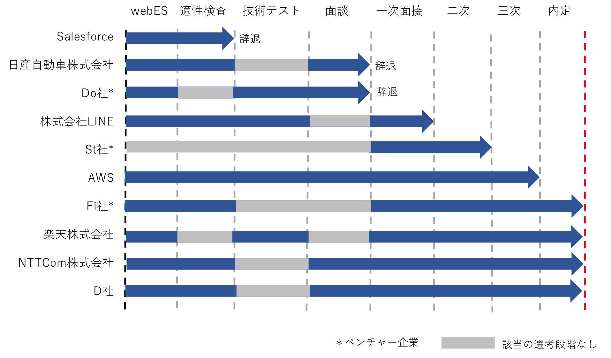
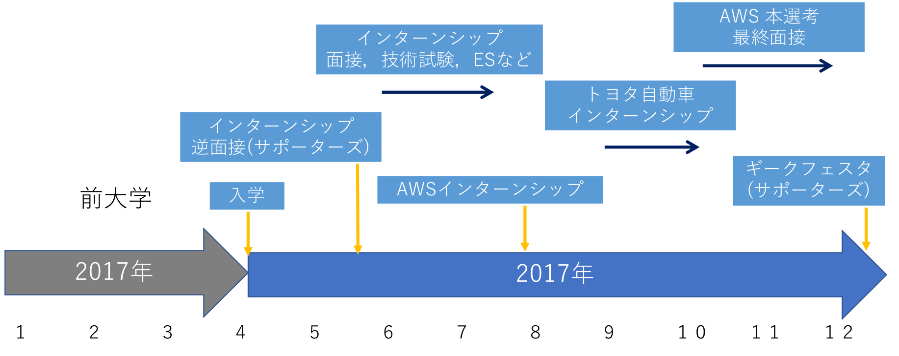
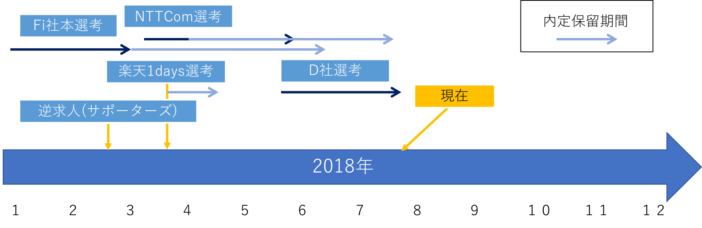

# 就活振り返り

久しぶりに更新します．@_tokina23です．

最近，大学院の修士中間発表と就活を無事に終えました．（2018/07末現在）

私は何度か書いていますが，（一応）国立の電気通信大学大学院に所属しています．この度，無事に？就活を終えましたので，その記録を残しておきたいと思います．

最終的にはD社（一部の人はわかるかもしれません）に決定しました．お世話になった方々には非常に感謝しています．

また，この記事が誰かの参考になればと思います．

まずは簡単に進学についての振り返りから．

//目次

## 電気通信大学大学院への進学

私は広島の国公立大学（広島大学ではない）にて学部時代を過ごしました．もともと，高校生のときから電通大には来たかったのですが，ちょっと偏差値が足りず断念．．

前大学ではまあまあの成績を収め，セキュリティキャンプやインターンシップ，研究活動などをそこそこにこなしていました．

もともとは「早期卒業資格を手に入れることができたら他大学院に進学しよう」と考えていましたが，やはり微妙に成績が足りず，残念ながらその資格は手に入りませんでした．

（一応弁解しておきますと，その世代は非常に優秀な方が多かったようです，，）

いざ学部３年も終わりが近づいてきたとき，とある友人が筑波大学大学院に進学したことをきっかけに，やはり自分も昔から行きたいと考えていた大学院にチャレンジする気持ちが湧いてきました．

しかし，そんなすぐにアグレッシブに活動できない私は，書類とりよせから何まで地味にゆるゆるとやることで，既成事実的に受験しなければいけない段階まで自分を自身で追い詰め，受験にチャレンジしました．（ちなみに推薦受験です）

研究室はあまり深くこだわらなかったので正直今後悔しているのですが，それはまた別の話・・・

研究を除いて，こっちの環境は広島のそれと大きな差がありました．それは情報量です．就活から勉強会やらなにまで，そのチャンスはそこら変にごろごろしています．こればかりはさすが東京，さすが国立だなあと思いました．

（補足）

電気通信大学大学院の推薦受験は所属大学の上位20％以上の成績であれば受験可能です．なおかつ，TOEICの点数の申請も不要です．一般はTOEIC申請必要だそうです．

## 就活のまとめ

### 就活の戦果

まず，私が本選考を受けたのは**10社**です．これはIT業界では多いほうかと思います．

私の軸は主に2つありました．それは「クラウド系」もしくは「自動車系」です．昨年度からクラウド技術に興味を持ち，そうした観点からインフラ業界にも目を向けていました．また，もともと自動車セキュリティの研究をしていた背景から，自動車業界にも興味を持っていました．

その結果は以下の図のとおりです．

実は最も早く選考に臨んだのはAWSでしたが，あえなく最終選考で落ちてしまい，そこから迷走が始まりました．一時期はこころが・・・となりましたが，現在は元気です．

LINEも受けました．正直，そんなに興味はなかったのですが，あの天下のLINE．新宿ミライナタワーに居を構えるその本社に向かうべくマクドナルドで技術試験を小一時間といたところ，無事に選考を通過し，一次面接に向かいましたが惨敗でした．

Fi社（社名は伏せます）は最も早く内定を頂いたベンチャーさんなのですが，様々な人の意見やキャリアパスから社会人として最初に入社する企業としては除外しましたが，結構悩みました．

NTTCom（クラウド系）は研究室の先輩からお声を頂戴し，何気なく足を運んでみたところそのライフワークバランスやクラウド事業に惹かれ，選考を受け（実際には選考という名目ではありませんでしたが），内定をいただきました．

D社に関しては，全くのあらぬ方向からのお誘いを受け，最初は何気なく話を聞くところから始まりました．当初はNTTComに行くかな，と考えていたのでお話程度のつもりですが，選考を受けにつれ，そのグローバルな立場でチャレンジできる点などから魅力を感じるようになりました．sの結果，この度内定を承諾するに至ります．ちなみにセキュリティ系（一応）になります．自動車セキュリティからIoTセキュリティまでやっていく所存だそうです．

少し総括しますと，ES，webテスト，技術テストはすべて通過できたので自分としてはまあまあだったかな，と思っています．しかし，結局面接で落ちているので，もっと企業を分析して自己アピールにつなげる必要があったかな，とか思ってしまいます．最終的に，**落ちる＝その企業は自分に合わない**　をモットーに自由に就活ができたので，１社でも内定をいただくと良い流れとなるかなと思っています．

### 選考を辞退した会社とその理由

選考を辞退した会社（選考段階途中で辞退，もしくは懇談や説明会などのみに参加）については以下の通りです．

- トヨタ自動車株式会社

昨年度のインターンシップに参加し，**行かないこと**を決意しました．私は本社の技術本部のセキュリティを行う部署に配属となりました．上司さんやその他の方たちには非常に良くしていただいたし，思ったよりお堅い雰囲気もなく，フレックス制度もあったので非常に悪いというわけではありませんでした．しかし，インターンシップ参加者（とくに **名古屋大！！！** の人たち）がいわゆるパリピであったこと，毎日渋滞が発生すること（トヨタ渋滞），周りになにもないこと，会社の雰囲気がぬるすぎること，などから私の肌にあわず選考受けることはやめました．座談会などに参加したのですが，やはりやめてしまいました．インターンシップだけなら貴重な経験ができたと思っています．

- 日産自動車株式会社

1dayインターンシップや勉強会に参加したのですが，端的にいうと，リクルータの人がめっちゃ鼻にかかる人でした．それだけで行きたくなくなりました．しかし，ここでできた友人と後にNTTCom再開したり，トヨタインターンの人にあったりなど，参加してよかったと考えています．

- BE社*
- Do社*
- Fi社* (内定辞退)
- GMOクラウド株式会社

サポーターズ経由でお話を頂いたので２度ほど行きましたが，選考を受けるほど業務内容や年収に魅力を感じず断念．

- パナソニックアドバンストテクノロジー株式会社

前の大学でも行くことができたため，よりチャレンジするという意味で今回は辞退させていただきましたが，非常に良い会社です．優秀な後輩がここでお仕事しています．

- セールスフォース・ドットコム（Salesforce)

ブラッ○企業であることをひしひしと感じたので断念．あとエンジニア職があんまりない．

- 楽天株式会社（内定辞退）

毎週月曜日の朝会や，毎日９時出社であること，３年後離職率５０％以上などから断念

- NTTCom （内定辞退）

最後まで悩んだものの，苦渋の判断の末辞退．転職先としてもありだと考えています．しいていうなら収入や企業の立地（朝の通勤）などが難．

### 大学院における就活関係の時期について

もしこれから就活される方がいれば，参考にしてください．

### いろんな就活サイトについて

私が利用したサイトは以下でした．

- サポーターズ

４月の段階から１dayインターンの案内が来たり，良いスタートダッシュをサポートしてくれるかなと思います．逆求人イベントなどで声をかけていただいて勉強会に参加するなどのチャンスを多くいただきました．

- マイナビ，リクナビ

Salesforceやトヨタ自動車株式会社にエントリーするためだけに利用しました．一度間違えてまとめてプレエントリーをしてしまってからしつこくいろんなところから電話が来たので正直恨んでいます．プレエントリーだけなのに電話してこないでほしいです．また，リクナビから直接特別選考案内をくれるサービス（リクナビエージェント）の登録の連絡がきたため，１週間だけ利用してみましたが，d-Space社などの珍しい案内がありましたよ．

- 各企業の採用ページ

結局直接エントリーすることが一番多かった気がします．行きたい企業はリサーチしておく事が大事だと思います．

**あとはどこに行くにしてもコネです（たぶん）**

## 最後に

重ねまして，就活でお世話になった方々にお礼申し上げます．

私としては，就活は学生として最も多くの企業を知ることができる最大の機会だと思っています．もちろん行きたい１社でバッチリ決めればいいのですが，落ちてから沢山の企業を知ることができるチャンスになったかな，と考えています（というかそう考えるしかない，，）．

もしAWSに入社させていただけたのであれば，それはそれで嬉しいのですが，それができなかったいま，今度は自動車セキュリティの道を進んでいくしかない！所存です

研究頑張ります！