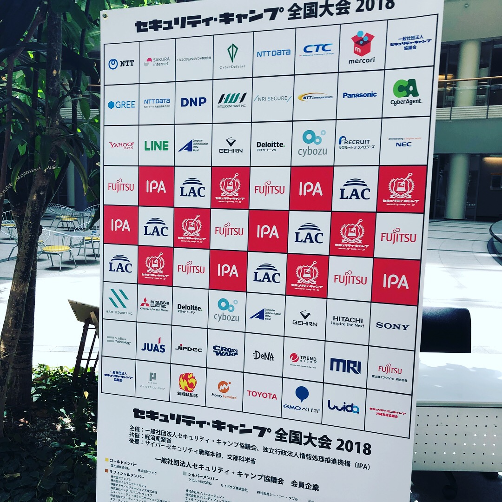
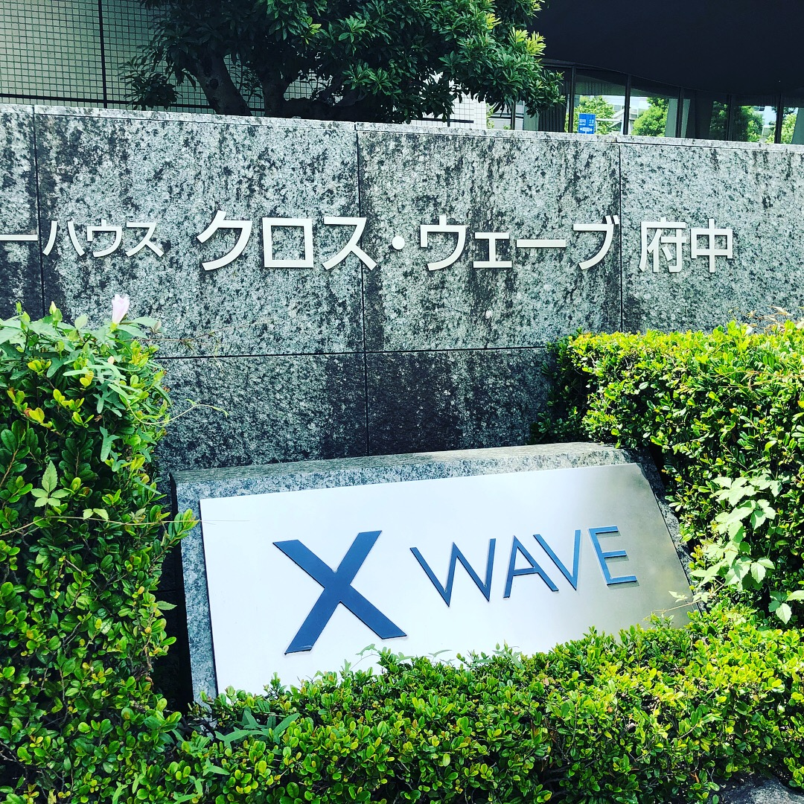
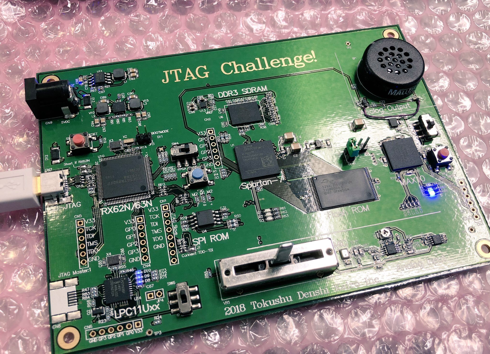
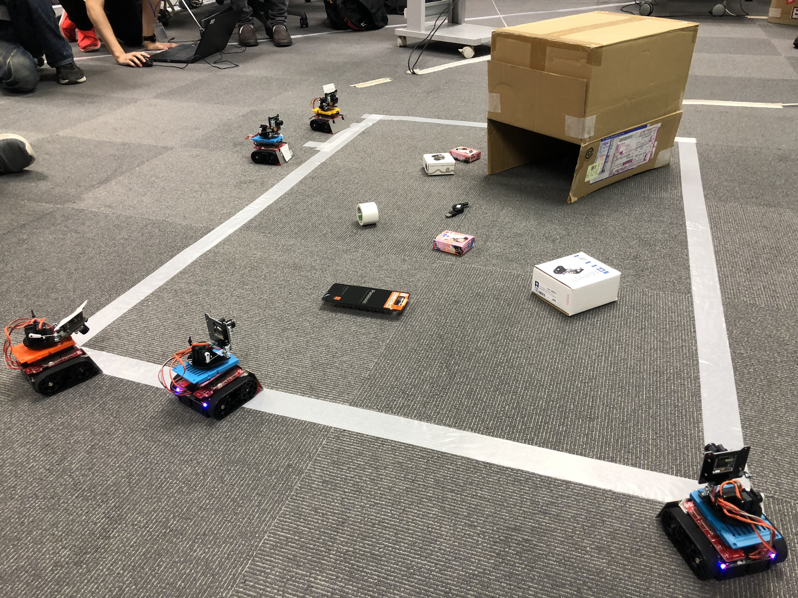
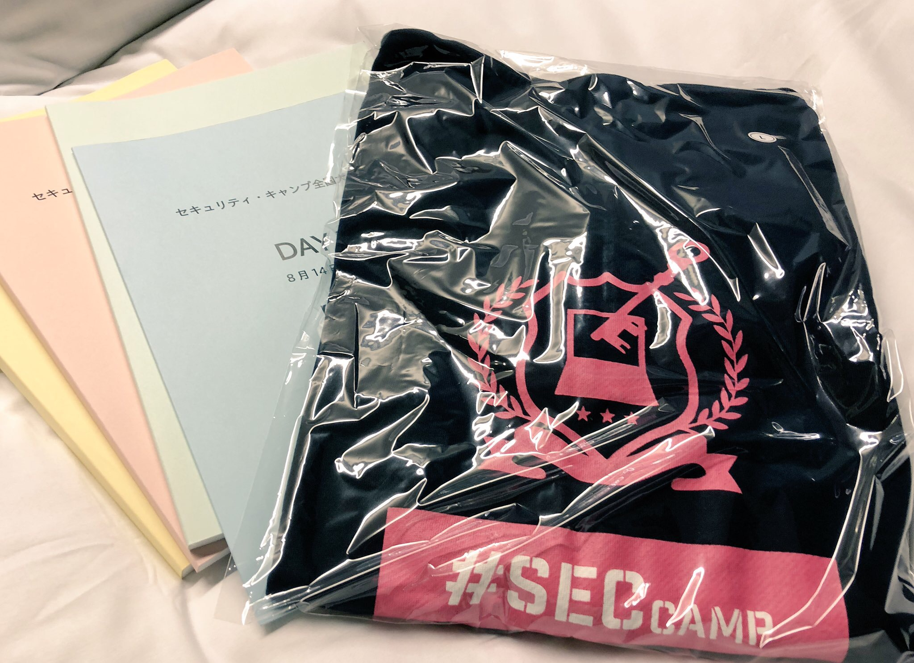
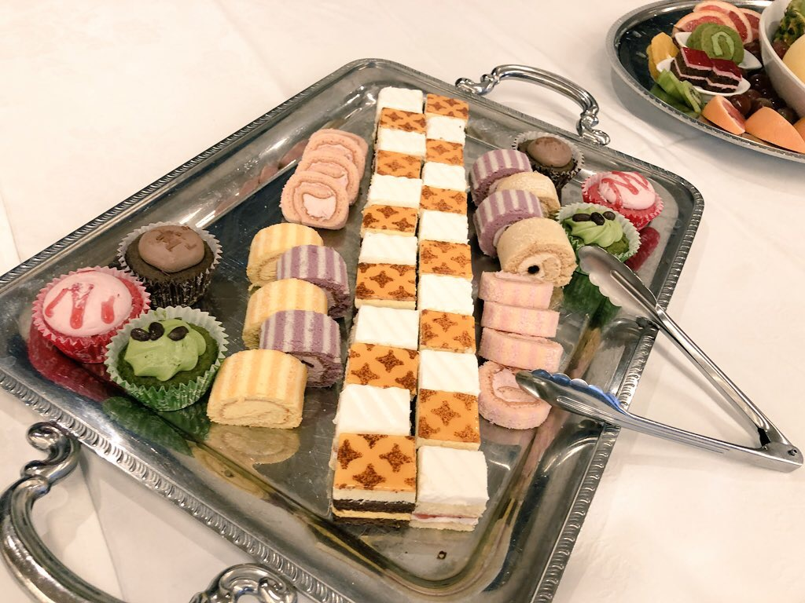

# セキュリティ・キャンプ全国大会 2018にチューターとして参加しました

2018/09/05

セキュリティ・キャンプについて書くのが遅くなってしまいました。いや、本気で遅いですね。

これ結構書くの大変でした。ちょっとお仕事などがあったりして、、、

改めまして、私は今年の8/14-8/18に開催されましたセキュリティ・キャンプ 2018 全国大会にチューターとして参加させていただきました。

https://www.ipa.go.jp/jinzai/camp/2018/zenkoku2018_about.html

（IPAの全国大会用公式サイトです）

*本記事はセキュリティ・キャンプを知らない人からチューター目線での意見を参考にしたい参加者などを対象と考えて書いています*

私自身B4(つまり年齢上限)の2016年度の全国大会に参加しました。あれから2年、より成長できる部分はきちんとできたかなあ、と考えています。当時はいまより技術力も専門力も自信もあまりなかったような…。今でも「ある」とは大きな声で言えませんけど、昔よりもできることは増えていると思います。

チューターには応募課題があるのですが、そこではSecHack365や各イベント、また以前のアルバイトの経験を書かせていただきました。SecHack365の関係者の方たちも多くおられるので、一部ではそうしたところでも評価していただけたのかな、と考えております。

今回は主に

- チューターとして何をしたか
- 講義について
- 私の目線から今年の参加者を見て思ったこと

について書きたいと思います。

## はじめに

今年は非常に猛暑，また去年から北府中のクロスウェーブで開催されており，暑い中キャリーケースを引きずっていくのは行くのも帰るのも一苦労でした．まあ現在住んでいるところから1時間30分くらいでしたので、どうにか、、

セキュリティ・キャンプ全国大会には複数の「トラック」と呼ばれる各分野のコースが存在します。参加者はこれから各参加したいトラック（もしくは講義）を選択していく形になります。参加者の人数の多さから、トラック数もA~E, X~Zと多様です。

2018年度のプログラムについてはこちらを御覧ください。

https://www.ipa.go.jp/jinzai/camp/2018/zenkoku2018_program_timetable.html

ちなみにですが、セキュリティ・キャンプには地方大会と全国大会があり、実はそれぞれで運営本体が微妙に違うとのことです。具体的には地方大会は株式会社ラック、全国大会はIPAが主体となって（現在は）運営しているそうです。

また、今年の主査はkozosや熱血アセンブラで有名な坂井さんでした。

## チューターは何をするの？

チューターのお仕事は主に各講義のサポートです。それぞれ担当のトラックに配属となり、各講義の課題や質疑、講義の運営の直接的サポート、アドバイスの提供などを行います。

また，全国大会ではLT大会が毎年恒例となっています．今年はチューターは参加必須，参加者や講師は任意という形でLT大会が開かれました．私はLoRaWANの研究をしているのですが，LoRaWANのセキュリティについての話をあまり調べたことがなかったため，今回はLoRaWANのネットワークレベルでのセキュリティについて簡単に調べて発表しました．本当は面白いネタがあればよかったのですが（苦笑）

私が話したスライドは以下になります．

今度IoTSecJPにてこれについてもう少し話をしようと考えています．

## 担当したトラックについて

今回私が担当となったのはDトラック（フィジカルトラック）でした。このフィジカルトラックは今年から開設されているトラックらしく，実はチュたーの応募が少なかったとかそうでもないとか．

このフィジカルトラックでは基本的に低レイヤーについて学びます．最近注目を集めているIoTですが，言い換えてみればこれは「組み込み」技術に他なりません．いままでインターネットとは隔絶されていた組み込み技術がつながるようになってきたため，この組み込み業界でもセキュリティを意識しなければ行けないようになってきたことを受け，フィジカルトラックが新たに設けられたのでしょう．結局，ここで大事になるのは10年も20年も前からある技術の再確認と，それを踏まえた上でどういう設計をしたらいいのか，になるのだと思います．

## D（フィジカル）トラックの講義について

私が担当していたDトラックの各講義についてのメモや感想などについてまとめておきます．また，ついでにおすすめ度合いについても書いておきます．

おすすめは☆３つくらいで個人的な視点や参加者を見ていた私が勝手に評価します．忖度はしません．

### D1 ドローンシステムにおけるセキュリティーガイドラインを作ろう！ 　

講師： 今村 博宣 （ドローンワークス株式会社）

初回の講義、こちらでは「ドローンの歴史とその活用法について」「DCoJA」についての講義でした．

参考までに，今村さんが公開していたSlide shareを共有しておきます．

<iframe src="//www.slideshare.net/slideshow/embed_code/key/ETwPNCJbh3mkHV" width="595" height="485" frameborder="0" marginwidth="0" marginheight="0" scrolling="no" style="border:1px solid #CCC; border-width:1px; margin-bottom:5px; max-width: 100%;" allowfullscreen> </iframe> 
 <strong> <a href="//www.slideshare.net/ssuser8b64a9/ss-76421526" title="「オープンソースによるドローン開発とクラウドサービス」" target="_blank">「オープンソースによるドローン開発とクラウドサービス」</a> </strong> from <strong><a href="https://www.slideshare.net/ssuser8b64a9" target="_blank">博宣 今村</a></strong> 

**目標：人が多いところで安全に飛ばしたい**

→今求められているのは「落ちても安全なドローン」の開発、販売

DCoJAはオープンソースで開発するドローン向けのフライトコントローラーなどの総称で

"Drone Community Japan Association"

の略だそうです．こちらについての取り組みなどについてのお話を聞くことができました．

https://github.com/DCoJA

講義の演習として取り組んだのは"ドローンのセキュリティには「どこに必要か」「何が必要か」"についての調査でした．

以下の4つに焦点を当てて各自取り組みました．

- TrusZone（ドローン上のソフトウェアについて）
- 認証について（運用レベルなど）
- 通信(インフラ、ネットワークについて）
- 耐タンパー性(ドローン上のハードウェア)

### D2 ROSロボットをハックせよ  ☆☆

講師： 中川 友紀子（株式会社アールティ 社長）

人工知能は最初「1970年代後半にマイコンと人工知能の実世界の応用教材としてマイクロマウスが利用されていた」

こちらの講義ではROS（Robot OS）に触れ，それぞれに用意されたロボットを実際にコマンドから制御することを目的としています．

事前課題として以下の本が配布されていたので，講義では実際にこの本に従って触ってみるという感じでした．

http://amzn.asia/d/6BV1KXP

実際にROSを利用した制御まで進んでいる参加者は一人しかいなかったのですが，マイクロマウスを触ったことがある参加者が結構いたり，皆シェルを作成してロボットを操作できていたので，参加者のレベルが高いように感じました．

また講師の方に質疑をする時間で，女性の講師ならではの意見などをお伺いすることができました．

その中で印象に残ったのは「CTF For Girlsみたいな女子だけで固まるのもよくわからない．女性は「かわいい」と思わないと続けてくれない．例えば親に「そんなことやってるともてない」とか言われることによって行かなくなってしまう．理系で女子は持てますよ，とかを伝えてくれれば良いのに，」と仰っていたことでした．

### D3 チップレベルでカスタマイズができることで見える世界の体験

講師： 秋田 純一（金沢大学 社長）

これまでのものづくりから、近年のものづくりの現状、ICの進化などについて聞くことができました。近年ではシンセンが強いそうです。

ベアメタルLチカなどをしているそうです。

<iframe src="//www.slideshare.net/slideshow/embed_code/key/3tH47xYPKxwCox" width="595" height="485" frameborder="0" marginwidth="0" marginheight="0" scrolling="no" style="border:1px solid #CCC; border-width:1px; margin-bottom:5px; max-width: 100%;" allowfullscreen> </iframe> 
 <strong> <a href="//www.slideshare.net/junichiakita9/cortexm0l" title="Cortex-M0プロセッサから自作して Lチカをやってみた" target="_blank">Cortex-M0プロセッサから自作して Lチカをやってみた</a> </strong> from <strong><a href="https://www.slideshare.net/junichiakita9" target="_blank">Junichi Akita</a></strong> 

本講義では実践編としてLSIの設計体験を行いました。

LSI設計：HDL，回路図などから半自動でレイアウト図へ
＋フルカスタム設計：直接レイアウトズ（製造パターン）を描く

HDL→（論理合成ツール）→ネットリスト（回路図）
　　　　　（→ライブラリ，制約条件）

今回のお題：MSP430（VerilogHDL)

今回使うツール：Qflow

半自動：論理合成，配置配線の各ステップは手動

Qflowで設計，レイアウトの確認までを行いました。

### D4 自走運転車両を攻撃せよ 

講師： 村松 菊男（e-SYNC株式会社 社長）

こちらの講義では主に組み込み業界の近年の動向についてのお話を聞きました．

また事前課題にはGR PEACHというmbedベースの組み込み機器をテストとして触ってみる課題がでていました．

http://gadget.renesas.com/en/product/peach.html

近年，自動車の自動化に伴い搭載されるCPUの高度化が進んでいるのは皆さんご存知だと思います．

そこで，自動車に搭載されるコンピュータであるECUやそのCPUについても進化が問われています．

Handobook for Robustness Validation of Semiconductor in Autmotve Applicationsが参考になるそうです．

- CPUのHOT SPOTの例：CPUをバランスよく使わなければ早く死んでしまう

- ADAS用デバイスの液体冷却システム
    - 1台2台くらい
    - パワーモジュールとか
    - 信頼⇔コスト

逆光，悪天候下でのロバスト性確保が重要→こういう状況も踏まえた技術も求められる

SECURE-ICというものがあり，サイドチャネル攻撃のための解析ツールをサポートしているそうです．

http://www.secure-ic.com

### D5 JTAGの原理と応用　☆☆☆

講師： 内藤 竜治（特殊電子回路株式会社）

JATGって何？そもそもなんのために？

まずはJTAGの歴史から、その基本的な機能について聞くことができました。

### D6 組み込みリアルタイムOSとIoTシステム演習 ☆☆☆

講師： 松原 豊（名古屋大学大学院情報学研究科）

後半の競技パートでは，ロボットを利用して各グループごとに競技が行われました．この競技では

- フィールド上にあるモノをフィールド外に運ぶ
- 他ロボットに侵入し，写真を盗む
- ネットワークレベルで妨害する

などです。ちょっとしたHardeningなどのネットワーク障害レベルでの対戦も期待できるのです．こちらの講義にはそこまで時間を確保できなかったのですが，一日集中してこの講義を行えばもっと本格的にいろいろチャレンジできると思います．

### D7 IoTのセキュリティを評価できるようにする ☆☆☆

講師： 松岡 正人（カスペルスキー）

こちら講義は割と印象に残っています．実際にこちらの講義と同様の講義を高専にてされたことがあるらしく，後半に行った議論においてセキュリティ・キャンプの参加者との違いについて考察されていました．

組み込みに強い参加者の方々とって「IoTシステムのアーキテクチャ」が新鮮だったことです．組み込みレベルから，IoTシステムを構成するクラウドレベルまでを体験する機械は珍しいのではないでしょうか．

また，NoT（Network of Things）という言葉もあるそうです．

今回はいくつかの実際の機器を参考にして，その機器について以下の5点に着目して分析を粉いました。ただし、調査した機器については公開できませんのであしからず、、某社の時計や、某社のロードバイクのツールなどが含まれていました。

「プリミティブ」

- Aggregator
- Sensor（Cluster,Sensor Cluster)
- Communication Channel
- eUtility
- Decision trigger

これについて解説している資料がありましたので、これらについて気になる方が入ればこちらを参照ください。

https://csrc.nist.gov/CSRC/media/Presentations/Networks-of-Things-(Demystifying-IoT)/images-media/2_iot_jvoas.pdf

参加者の方も、驚異の切り分けや、いままでなかった視点を持つきっかけになったようでした。

また、実際に自分たちで考えることで全体の構成を捉えることができたようです。

## 今年のグループワークについて

さて、例年恒例のセキュリティ・キャンプ全国大会のグループワークでしたが、今年はなんとグループワークそのものは存在しませんでした。

今回はフォームに個人それぞれで作文を入力する（1500文字とか）、といった形でしかなく、実質グループワークとはあまり呼べないものでした。

それぞれ、今後自分が取り組んでみたいこと、やこれから先このセキュリティ・キャンプの経験をどう活かしていきたいのか、を考える、といった内容でした。

また、そうした考えをまとめる際に、チューターや講師の方々にいろいろと質問して、参考にしてほしい、とのことでした。

ですがこのグループワークではない実際の個人ワークのため、例年より一人で食事をする人が多かった気がします。私のときは食事の時間もグループワークについて話し合うため、食事のときも集まっていた記憶があります。

しかし、今年はこのグループワークより、各トラックごとの**成果発表**のほうがメインだったように思います。

夜に1時間ホームワークと呼ばれる時間があり、この時間を利用して各トラックにて成果をまとめ、最終日に発表する、といった形です。ちょっとしたLTですが、「各コースごとにどういう取り組みをしたか」を共有できるため、これは非常にいいなと思いました。来年以降もやるんでしょうか？

この中で特にAlexaなどのスマートホーム機器のハッキングをしていた参加者の話が面白かったと感じました。

## 最後に

そもそも、私がチューターに応募したのは締切１時間くらい前でした。

全国大会の修了生が所属するサイボウズLIVEのグループがあるのですが（サイボウズLIVEがなくなるとどうなるんだろう？）にて応募があったのは知っていたのですが、このときの自分は就活でてんてこまいで、確か最終的に内定を頂いた会社の面接が終わった後すぐに書いた記憶があります。

「チューター」に対して、私はとても敷居が高いイメージが有り、昨年度はAWSのインターンが重なっていたことから断念してしまいました。今年はチャレンジのつもりで応募したみたのです。もちろん、短時間で応募課題を書いたものの、しっかり見直しアピールできるところは抑えていたつもりです。

また，全国大会の最後に各方面で有名な方々がイベントなどについて告知をしておりました．

その中で最も気になったのがCODEBLUEのかなさんがいっていたGlobal Cybersecurity Camp（GCC）についてです．

どうやらアジア周辺の大学などが協力してサイバーセキュリティについて学ぶ機会を提供するそうです．

https://www.boannews.com/media/view.asp?idx=72182

まだ現時点（執筆時2018/09/05)ではこの応募については未だ公開されていないようですが，来年の１～２月にイベントが開催予定？とのことをおっしゃっていたような気がします．修士論文などありますが，私も機会があれば応募などしてみたいと考えています．

参加者の皆さんの成長を応援しています！私も負けないように．．．

あ、そういえば10月末～11月頭に例年通りCode BlueとAVTokyoがありますね。もしかしたら私も顔を出せるかもしれないです。

### おまけ

今年は”セキュリティ・キャンプパーカー”がありました．参加者以外の人は2000円で購入できました．また，スイーツの立食パーティーもあり，今年はこういった面では豪華だった気がします．スポンサーにトヨタやデロイトもいたようですしね．

#SECCAMP