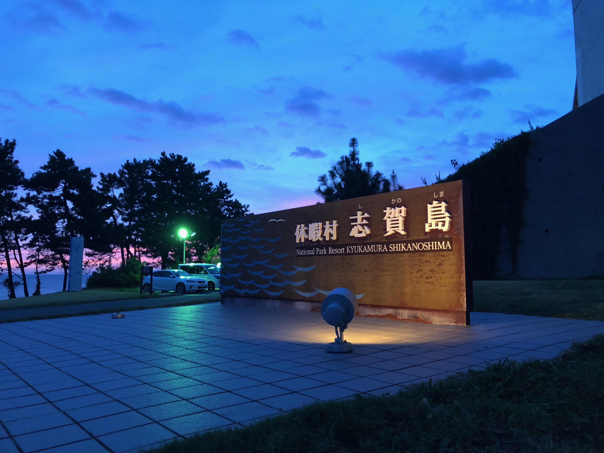

# SecHack365'18福岡回にOB生として参加してきました

昨年2017年度に参加させていただきましたSecHack365ですが、先日ありましたSecHack365'18へ修了生(SecHack367)として参加させていただきました。

https://sechack365.nict.go.jp/

まずはお呼び頂いた関係者各位、誠にありがとうございました。今回は私（@_tokina23）、@isekatusi、@takuzoo3868の3人でした。

実は今回ドンピシャで台風がぶつかり、飛行機が降りれるのか、海が荒れているのは、など心配なことは多かったのですがすべて滞りなく終わって安心しました。

もちろん、きれいな海も見れましたし、泳ぐこともできました。海に入ったのは10年以上ぶりかもしれない、、

今回修了生として行ったのは主に

- 昨年度の取り組みについてのプレゼン
- 修了生として、グループ活動としてのアドバイス
- グループワーク、コースワークなどのお手伝い

でした。

ここで、発表したスライドをここに貼っておきます。今年度グループを考えている参加者や、来年以降参加を考えている方は参考にしてください。

## SecHack365福岡回の大体の日程について

### 一日目 08/22

株式会社Nulabさんにて会社の成り立ちやエンジニアの人とコミュニケーションできる時間をいただきました。

また、最後に私たち修了生から、昨年度の取り組みやアドバイスなどについてのプレゼンをしました。

この日は主にこれでおしまいでした。

ちなみに修了生の部屋はいつでもきていいよ、とのお達しでした笑

### 二日目 08/23

二日目はトレーニー一人一人の進捗発表会の日でした。一人5分で進捗についてのプレゼンを行います。すでにデモまで行っている人も多く、さすがや・・・となりました。

この進捗発表は一人5分ですが朝9時からやって17時に終わりました。皆さん本当にお疲れさまでした！

また、自然発想法という名のもと海に入りました。海の水はしょっぱいんですね、、この日は台風が近づいていましたが、波は穏やかで海に入れる絶好のチャンスだったように思います！

よるには恒例？の倫理についてのお話を聞く機会がありました。

### 三日目 08/24

最終日はメインはハッカソンやアイデアソンなどでした。

また、この福岡回はグループを作る期限というか、区切りとなるタイミングでしたので、そうしたグループワーク的な時間が多かったようです。

最終的にだれとどんなものを作るか、修了生やトレーナーの方たちのアドバイスなどを参考に皆で悩んでいるようでした。

ちなみに帰りに福岡バスターミナルにてもつ鍋を@takuzoo3868くんと食べました。だしがめっちゃ効いており、しめのご飯が最高でした！（？）

## 今年のSecHack365の魅力

今年のSecHack365にあって昨年度はなかった魅力について考えてみました。

まず、一番大きな違いは”コース”制であることでしょう。以下は公式サイトからの引用です。

>■表現駆動コース
まず最初に、「興味があるもの」や「作りたいもの」を発表や議論を通じて表現し、練りあげながら進めるコースです。表現したものに対して、いろいろな人からのフィードバックを集めて、作品として仕上げていきます。進捗や課題等も定期的に発表、議論をして、作品作りを進めてもらいます。

>■思索駆動コース
身の回りにある、「ちょっと気になるささいな問題」にまなざしを向けるところから始め、その問題の解決をじっくり考えながら進めるコースです。思索と対話の繰り返しを通して、「問題の解決を実現できるサービスやシステム」を考案し、試作、実装、ローンチまで漕ぎ着ける根性が求められます。

>■開発駆動コース
興味ある技術や作りたいものに対して、早速開発を始めるコースです。
まずは興味ある技術や自身が作りたいものを作ります。もしくはトレーナーの判断で勉強から始めてもらう場合もあります。

毎回オフラインイベント時には皆で集まるのは昨年と同様ですが、今年は特にコース別に分かれていることから、より進めたい人は進める、よりじっくり考えたい人は考えることができるようになっています。

さらに各コースには普段であれば直接会うことがないスペシャリストがメインのトレーナーがいるので、より密接なコミュニケーションが可能となっています。

また、コースによっては毎回のオフラインイベント時にナイトハッカソン的なことをしているらしく、充実したオフライン回となっており非常に楽しそうでした。

またコースごとにコミュニケーションが少ないかと心配しましたが、そんなことはなさそうで安心しました。

ちなみに昨年問題になった大阪は今年はなく、愛媛と山形になったそうです。個人的に山形には訪れたことがないのでうらやましい限りです。

## 今年のSecHack365の人たちを見てて思うこと

今年の参加者を見ていて思ったことを書いてみます。

- 昨年度より技術レベルが高い人達が集まっている！（気がする）
- AR/VR領域のハッカソンが多い気がする（昨年度はいなかった）
- 本を書く人が3人くらいいる（昨年度はいなかった）
- 認証系のハッカソンも多い気がする（昨年度はいなかった）
- AWSやAzureがとても活用されている！
- 進捗が早い！→夏の時点でちょっとしたプロトタイプの作成ができており、その「見せ方」などハッカソン以外の部分にも注力する時間が取れる

などを感じました。昨年度の取り組みの結果、今年はさらに充実しているようでうらやましい限りです。

また、私と話してSecHack365を知ってくれた人もおり、昨年度の私たちのアウトプットが今年にちゃんとつながっていることを感じましたね。

## 最後に

次回は山形回だそうですね。今度は修了生はだれが呼ばれるのでしょうか、、、？（まだ決まってないらしい）

今年度も昨年と同じように報告会があると思います。もしできればそちらに顔を出させていただきたいです！

また、修了生として、Twitterなどでも少しでもサポートができればよいなと考えています。

SecHack367でまっています！

## おまけ

昨年度の皆さんの取り組みが公式サイトに一覧になっています。

https://sechack365.nict.go.jp/2017artifact/

また、修了生コミュニティを目指してTwitterで@SecHack367が爆誕しているようですが・・・？

https://twitter.com/SecHack367

