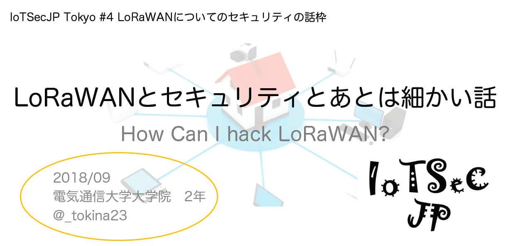

# LoRaWANとセキュリティとあとは細かい話 [IoTSecJP Tokyo #4 振り返り]

How Can I Hack LoRaWAN?

先日、「LoRaWANとセキュリティとあとは細かい話」という（適当な）タイトルでIoTSecJPにてお話させて頂きました。今回は13時30分から18時半と長丁場でしたね。皆様お疲れ様でした。

初めてブログでLoRaWANのお話をする気がします。正直、まだまだこの分野（特にSDRとか）は私はまだ素人の段階なので少々キョドってしまった気がします。。

本記事ではお話させていただいたスライドの補足から、SDRを利用したハックについてもう少しメモを残しておきたいと思います。

さて、早速ですが私が発表したスライドはこちらです。

<blockquote class="twitter-tweet" data-lang="ja">
先程話したスライドになります． HackRFでLoRaWANのデータの中身を見れました．<a href="https://t.co/6HuViG4li8">https://t.co/6HuViG4li8</a><a href="https://twitter.com/hashtag/IoTSecJP?src=hash&amp;ref_src=twsrc%5Etfw">#IoTSecJP</a>
&mdash; tokina(ひみつ) (@_tokina23) <a href="https://twitter.com/_tokina23/status/1040861432315670529?ref_src=twsrc%5Etfw">2018年9月15日</a></blockquote>  

※タイトルスライドの2018/08は正しくは2018/09です(´ . .̫ . `)

//目次

## 補足

細かいところなどを自分でもう一度調べながら補足します。間違いなどありましたらご指摘ください。

まず、LoRaWAN™は**仕様がオープンされています**が、**オープンソースではありません**。

これは公開版のスライドが間違っていますので、ここで謝罪します。ごめんなさい。（発表した資料は修正してありました）。

ですが、実際に利用されているノードやゲートウェイにはオープンソースハードウェアなものも多いです。

また、詳しく述べなかったのですがLoRaとLoRaWANは別ものです。

LoRaというのは物理変調規格のことで、このチップについては非公開となっています。

LoRaWANは無線技術のことを指しています。

### LoRa Alliance™ and The Things Network(TTN)

LoRaWANの基本的な仕様はLoRa Alliance™が策定しています．

LoRaアライアンスの公式サイトはこちらになります．

https://lora-alliance.org/

また，仕様書やホワイトペーパーなども提供しています．最新の仕様書v1.1(specification v1.1)はこちらになります．PDFが提供されています．できればこれを翻訳してみたいのですがどんどん更新されるためなかなか・・・，

https://lora-alliance.org/resource-hub/lorawantm-specification-v11

仕様自体の詳細以外にも、Back-End InterfacesとRegional Parameterについても公開されています。

また，The Things NetworkというLoRaWAN向けのクラウドサービスがあります．実質公式といっても過言ではないほどよく使われており，海外でのプロトタイプ記事などではTTNと略されることが多いです．日本語のページも用意されています．

https://www.thethingsnetwork.org/country/japan/

また，公開＆非公開も含めて登録されているLoRaGatewayをMapで確認することもできます

https://www.thethingsnetwork.org/map

#### Member White Paper: End to End Secure LoRaWAN™

https://lora-alliance.org/resource-hub/member-white-paper-end-end-secure-lorawantm

こんなものが今年の8月にリリースされているのに今更気づきました。

やはり新しい技術だけあって毎回調べ直さないとどんどん新しいものがでてきますね。

こちらの資料はノードとGW間のセキュリティについてまとめています。こちらではKey Management System(KMS)やHardware multiple levels of isolation(実行環境の独立化)について書かれています。

ホワイトペーパーがこうして出されているのは、決まった仕様がない今、セキュリティについて言及されていることから、少しでも急いで出したいという気持ちがあるのでしょう。

たぶん正式に年内には仕様が出るのではないでしょうか。

### ARIB STD-T108について

こちらの方の資料が非常によくまとまっているので、ARIBについて知りたい方はこちらをご参照ください。しかし、最新版のARIB STD-T108ではないのでご注意ください。

https://www.slideshare.net/tanupoo/lorawan-as923-arib-stdt108

登壇が終わり、Twitterを開くと

<blockquote class="twitter-tweet" data-lang="ja">
ARIB STD-T108の英語版は無料 <a href="https://t.co/EKr0WUMWYE">https://t.co/EKr0WUMWYE</a> 外圧のため英語は無料で日本人にハードルを課すモデル <a href="https://twitter.com/hashtag/IotSecJP?src=hash&amp;ref_src=twsrc%5Etfw">#IotSecJP</a>
&mdash; lumin 求人活動中 (@lumin) <a href="https://twitter.com/lumin/status/1040857100077813760?ref_src=twsrc%5Etfw">2018年9月15日</a></blockquote>

<blockquote class="twitter-tweet" data-lang="ja">
ARIBの標準規格類は昔は無料で入手できたけど今は日本語版だけは有料、英語版は今でも無料で入手できるけど日本語版に比べて古いバージョンのことがある <a href="https://twitter.com/hashtag/iotsecjp?src=hash&amp;ref_src=twsrc%5Etfw">#iotsecjp</a>
&mdash; NV(*´ω｀*) (@nvsofts) <a href="https://twitter.com/nvsofts/status/1040856998919659520?ref_src=twsrc%5Etfw">2018年9月15日</a></blockquote>

luminさんとNVさん、ありがとうございます。

私がARIB STD-T108を入手したのは今年の2月（割と最新版@20180122が出てすぐ）だったのですが、どうやら英語の最新版が無料で公開されているとのことです。知らなかった・・・。一体いつの間に！！

ほら、ここに”無料ダウンロード”とあります！なんで英語版が無料なのかさっぱりわかりません。足元見てるんでしょうか。

https://www.arib.or.jp/kikaku/kikaku_tushin/std-t108.html

実はARIB関係は指導教員である教授が強いので、その関係で入手しやすかったです。

### SDR(software defined radio) Hacking for LoRaWAN

私「ん～、とりあえずGqrxでLoRaWANの電波みれたけどこれじゃ面白くないなあ。」

教授「なに、これでLoRaWANのデータみれないの？」

（とりあえず調べる私）

<iframe width="560" height="315" src="https://www.youtube.com/embed/NoquBA7IMNc" frameborder="0" allow="autoplay; encrypted-media" allowfullscreen></iframe>

私「完璧に理解した」

gr-loraというLoRaWANをデコードしてくれるツールがあるらしいことがわかり、いろいろ調べて今回の登壇内容のデモ＆資料が出来上がりました。

詳しくはわからないのですが、gr-loraというツールには古いものと新しいもの
（forkされた？）があります。

2年前からあまり更新されていないものがこちら。

https://github.com/BastilleResearch/gr-lora

私が今回試したのはこちらです。

https://github.com/rpp0/gr-lora

環境の用意からの詳細についてはまた別の記事にしたいと思います。（近い内に書くぞ）

### 周波数のトレース？について

**「LoRaWANの運用では、実際には複数のチャンネルを行き来するのですが、それらを解析（トレース？）できるのか？」**との質問をいただきました。

正直よくわからなかったのですが、LoRaWANでは複数チャネルを利用することについては知っていました。

そもそもClassBビーコンや連送は別の周波数だからです。それらについて知るためには結局Gqrxなどを利用して複数の周波数をモニタリングするしかないのかなあと思いました。

このときは気づかなかったのですが、今になって

「gr-loraを用いたDecodeを行う際に指定する周波数をどうやって知るのか？」

という意図だとわかりました。ちょっとこれについては私も今後試してみたいと思っています。

今回はノードの実装プログラムが手元にあり、使用する周波数がわかっていたので、これが不明な状態であることを前提としたスニッフィングについて検討してみます。

### SDR Hacking for XX

SDRは電波を出すものなら何でもいけます。今回御社に貸与頂いたHackRF ONEは1MHz~6GHzまで対応しているので、キーフォブ、LoRaWAN、Sigfox、WiFiなどなんでも（もちろん法律の範囲内で）いけます。私もこれから勉強していこうと思うのですが、手元にあった書籍で使えそうなものを紹介しておきます。これ以外にもありましたらぜひ教えていただきたいです。

- IoT Hackers Handbook: An Ultiimate guide to Hacking the Internet of Things and Learning IoT Security (Aditya Gupta)

SDRの基本的な使い方からGNU Radioを利用したDecodeまでの基本が学べます。もし手に入る方がいればぜひこちらを読んでみると良いでしょう。私は以前こちらの本を心優しい方に購入していただきました。とても感謝しています。

<iframe style="width:120px;height:240px;" marginwidth="0" marginheight="0" scrolling="no" frameborder="0" src="https://rcm-fe.amazon-adsystem.com/e/cm?ref=qf_sp_asin_til&t=himitu0b-22&m=amazon&o=9&p=8&l=as1&IS1=1&detail=1&asins=1974590127&linkId=c47715e169f19f8fbe547c450da310a5&bc1=ffffff&lt1=_blank&fc1=333333&lc1=0066c0&bg1=ffffff&f=ifr">
    </iframe>

- カーハッカーズ・ハンドブック (Craig Smith, 井上 博之)

もちろん、自動車セキュリティ分野でもSDRは活躍（？）します。例のカーハッカーズハンドブックではTPMS（タイヤのモニタリングシステム）やキーフォブのハッキングについても紹介されています。今度これについても試してみたいと思います．

<iframe style="width:120px;height:240px;" marginwidth="0" marginheight="0" scrolling="no" frameborder="0" src="https://rcm-fe.amazon-adsystem.com/e/cm?ref=qf_sp_asin_til&t=himitu0b-22&m=amazon&o=9&p=8&l=as1&IS1=1&detail=1&asins=4873118239&linkId=c6e1c6276aa88e5b52a40dd67990c3ef&bc1=ffffff&lt1=_blank&fc1=333333&lc1=0066c0&bg1=ffffff&f=ifr">
    </iframe>

- ハッカーの学校 IoTハッキングの教科書 (黒林檎, 村島 正浩)

また、先日発売されました黒林檎(@r00tapple)さんの「ハッカーの学校 IoTハッキングの教科書」においてもSDRについて紹介されています。ここではSDRを利用したReplay攻撃の方法について見ることができます。

<iframe style="width:120px;height:240px;" marginwidth="0" marginheight="0" scrolling="no" frameborder="0" src="https://rcm-fe.amazon-adsystem.com/e/cm?ref=qf_sp_asin_til&t=himitu0b-22&m=amazon&o=9&p=8&l=as1&IS1=1&detail=1&asins=4781702368&linkId=5389c975028b81ef5fa63a40953a5559&bc1=ffffff&lt1=_blank&fc1=333333&lc1=0066c0&bg1=ffffff&f=ifr">
    </iframe>

## 最後に

法律には気をつけて

日本ハッカー協会に登録した話

## おまけ

白百合さん（@WhiteLily6u6)さんが同日にまとめを書いてくれていますので、ぜひ興味のある方はご一読ください。

http://whitelily6u6.hateblo.jp/entry/2018/09/16/220313