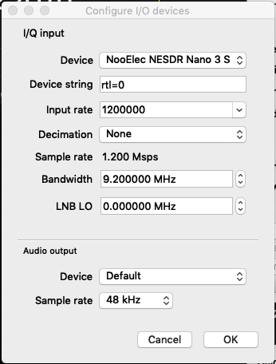

# RTL-SDR(nano 3)とURH(Universal Radio Hacker)を使ってみた

こちらはセキュリティキャンプアドベントカレンダー9日目（12/9）の記事になります．

https://adventar.org/calendars/3191

私はセキュリティキャンプ全国大会2016の卒業生で．今年の全国大会チューター、その他地方大会のチュータなどしてました．

先月，PacSecにてTrend Microさん主催のRF CTFという世界初のCTFに参加してきました．

今回はその際にいただいた**nano 3**というSDRの利用方法のメモなどを残して置きたいと思います．セキュリティは関係ないかも？

また、私は現在SDRについては勉強中の身なのですがさいきんやっといろいろできるようになりました。そこで**Universal Radio hacker**という便利なツールを見つけたので、ついでに紹介しようと思います。

https://www.pacsec.jp

> 「PacSecセキュリティカンファレンス」は、世界先端の情報セキュリティ専門家による最新の研究発表の講義と国際交流できる環境を兼ね備えた場を用意し、日本での先進的なセキュリティ人材育成への技術教育の場を提供する国際カンファレンスです。

また，PacSecでのメインのCTFはZero day Initiative主催のPWN2OWNです．

https://www.zerodayinitiative.com

来年以降も様々なイベントでRF CTFを主催したいと考えているそうです．

//目次

## SDR(Software Defined Radio)

皆さんご存知、ソフトウェア（定義）無線です（？）

> **ソフトウェア無線（Software-defined radio）**とは、[電子回路](https://ja.wikipedia.org/wiki/%E9%9B%BB%E5%AD%90%E5%9B%9E%E8%B7%AF)（[ハードウェア](https://ja.wikipedia.org/wiki/%E3%83%8F%E3%83%BC%E3%83%89%E3%82%A6%E3%82%A7%E3%82%A2)）に変更を加えることなく、制御[ソフトウェア](https://ja.wikipedia.org/wiki/%E3%82%BD%E3%83%95%E3%83%88%E3%82%A6%E3%82%A7%E3%82%A2)を変更することによって、[無線通信](https://ja.wikipedia.org/wiki/%E7%84%A1%E7%B7%9A%E9%80%9A%E4%BF%A1)方式を切り替えることが可能な無線通信、又はその技術。一般的には、広い[周波数](https://ja.wikipedia.org/wiki/%E5%91%A8%E6%B3%A2%E6%95%B0)範囲において多くの[変調方式](https://ja.wikipedia.org/wiki/%E5%A4%89%E8%AA%BF%E6%96%B9%E5%BC%8F)が可能となるよう、ソフトウェアが、なるべく汎用性の高いプログラム可能なハードウェアを制御するものとして考えられている。

https://ja.wikipedia.org/wiki/ソフトウェア無線

簡単に言うと、従来はマシンスペックが足りずできなかった処理をソフトウェアレベルで行うことで、ソフトウェアでより柔軟に無線を扱えるようになったものです。詳細はぐぐってください。

その歴史は1970年代の軍事利用目的の開始までさかのぼります。一般的な利用は1990年代の携帯電話網の送受信（トランシーバ）目的で開発されたことのようです。

また、日本語のSDRのページより英語版のほうが内容が充実しています（というか未翻訳状態）。

https://en.wikipedia.org/wiki/Software-defined_radio

現在、SDRの利用の目的は大きく分けて**軍事利用**と**アマチュア無線/個人利用**と言われています。GNURadioについても取り上げられています。

> More recently, the [GNU Radio](https://en.wikipedia.org/wiki/GNU_Radio) using primarily the [Universal Software Radio Peripheral](https://en.wikipedia.org/wiki/Universal_Software_Radio_Peripheral) (USRP) uses a [USB](https://en.wikipedia.org/wiki/USB) 2.0 interface, an [FPGA](https://en.wikipedia.org/wiki/FPGA), and a high-speed set of analog-to-digital and digital-to-analog converters, combined with reconfigurable [free software](https://en.wikipedia.org/wiki/Free_software). Its sampling and synthesis bandwidth is a thousand times that of PC sound cards, which enables [wideband](https://en.wikipedia.org/wiki/Wideband) operation.

無料で利用でき、FPGAの設定をいろいろいじって利用できるため現在は多くの人に使われています。この前私が試したLoRaWANのデコードもGNURadioを使いました。電波のソースにSDRサーバを指定できたりと、様々な利用が可能になっています。

## nano 3を試す！

いただいたnano 3はこんな感じの非常に小さくかわいいコンパクトなモジュールです。現在はこれに小さなヒートシンクをつけて使っています。


こんな感じで，非常にシンプルなSDRとなっています．なお，”HOT⚠️"です．

検索すると，以下のNooElecのサイトがヒットします．

http://www.nooelec.com/store/nesdr-nano-three-otg.html

> The ultimate SDR bundle for USB On-The-Go applications. 
>
> Includes NESDR Nano 3 in an anodized aluminum enclosure, nano-sized antenna, 4 USB OTG adapters. heatsink and an articulating adapter for SMA antennas.

すぐにいろいろな端末で使えるのが利点だそうです．

Amazonでも取扱いしています．

http://amzn.asia/d/auufv75

**RTL-SDR**とは

> **RTL**-**SDR** is a very cheap software defined radio that uses a DVB-T TV tuner**dongle** based on the RTL2832U chipset. ... Essentially, this means that a cheap $20 TV tuner USB **dongle** with the RTL2832U chip can be used as a computer based radio scanner.

https://www.rtl-sdr.com

だそうです．安価で利用できるSDRのことを指しており，TVチューナーなども含まれるそう．

**US$32.95**！安い！

気になるスペック等はこちら

| USB Interface IC              | RTL2832U                                                     |
| ----------------------------- | ------------------------------------------------------------ |
| Tuner IC                      | R820T2                                                       |
| Frequency Range (approximate) | 25MHz - 1750MHz                                              |
| TCXO clock                    | Yes                                                          |
| Antenna Connector Type        | MCX                                                          |
| Antenna Included?             | Yes                                                          |
| Remote Included?              | No                                                           |
| Additional Accessories        | Includes anodized aluminum enclosure, heatsink, articulating adapter for SMA antennas, nano-sized antenna and 4 USB OTG adapters. |

HackRF ONEといった高価かつ高機能なSDRとの大きな違いはサンプリングレート，つまり1秒間あたりの信号サンプル数，時間分解能です．HackRF ONEでは20Mbps (up to 20 million samples per second)ですが，RTL-SDRでは約3Mbpsです．

また，公式サイトにてnano 3を利用するためのいくつかのソフトウェアが提供されています．


ここでは以下のOSに向けてソフトウェアやインストール手順が紹介されています．

- Windows Installation
- Mac (OS X) Installation
- Android Installation
- Linux Installation

Android端末とあるように，nano 3はモバイル端末でもSDRが利用しやすくなっており，一般的なツールと互換性があるようです．手元にあるAndroid端末はUSBホスト機能がなかったので試せなくて残念でした．

入手時のパッケージにもUSB typeAをマイクロUSBに変換するケーブルやアダプタが同梱されています．残念ながらiPhoneでは使えなさそうです．

また，パッケージには小さなヒートシンクも同梱されており，HOTへの対策はきちんとされています．

Androidなどでnano 3を利用する場合は公式サイトに示されているソフトウェアを利用するのがよいですが、今回は一般的なSDRにこれを利用したかった（HackRF ONEのとき利用していたツールなどを試したかった）ので、それらについて調べて試しました。

結論から述べると，特に問題なく使えることが分かりました．

### nano 3で電波のモニタ

それでは実際に利用する方法や様子をまとめておきます。

まず，MacOS上でlsusbしてデバイス情報を確認してみます．

```
 〉lsusb
...
Bus 020 Device 018: ID 0bda:2838 Realtek Semiconductor Corp. NESDR Nano 3  Serial: ***
...
```

やはり電波をとりあえず見るにはGqrxというツールが一番利用が楽ですし便利です．nano 3の公式サイトではその利用方法については書かれていませんでした，

http://gqrx.dk

- MacOS

Macではそのまま認識され、Gqrxを開くとそのまま利用することができます。Configはこんな感じになります．Input rateを1200000に設定します．




FMラジオはだいたい80MHz~100MHzです．とりあえず確認して，なにか音が聞こえるか試してみました．

> TOKYO FMは周波数80.0MHzで、東京タワーから、檜原中継局（2015年12月開局）は西多摩郡檜原村から周波数86.6MHzで放送しています。

https://www.tfm.co.jp/listen/sp/


ノイズが多いですが，なにか聞こえます．

- Linux(Xubuntu)

今回試す環境ではVirtualboxを利用しているので，「Devices→USB→NooElec NESDR Nano 3」で追加します．しかしLinux上で動かすには，そのままでは利用できませんでした．

そこで， "/etc/modprobe.d/fbdev-blacklist.conf"に以下を追加します．

```
blacklist dvb_usb_rtl28xxu
blacklist rtl2832
blacklist rtl2830
```

設定後，再起動したら認識されました．


こちらは飛行機の中で電波を観測している様子です．

### LoRaWANのデコードをしてみる

こちらで紹介していたgr-loraをnano 3でも利用してみました。特に問題はなく利用できるようです。

http://tokina.hatenadiary.jp/entry/2018/09/21/174127

https://github.com/rpp0/gr-lora

```
/gr-lora_n3/apps$ python lora_receive_realtime.py 
linux; GNU C++ version 5.3.1 20151219; Boost_105800; UHD_003.009.002-0-unknown

Using Volk machine: avx_64_mmx_orc
gr-osmosdr 0.1.4 (0.1.4) gnuradio 3.7.9
built-in source types: file osmosdr fcd rtl rtl_tcp uhd miri hackrf bladerf rfspace airspy redpitaya 
Using device #0 NooElec NESDR Nano 3 SN: ******
Found Rafael Micro R820T tuner
[R82XX] PLL not locked!
Exact sample rate is: 1000000.026491 Hz
[R82XX] PLL not locked!
Bits (nominal) per symbol: 	5.5
Bins per symbol: 	2048
Samples per symbol: 	16384
Decimation: 		8
```

研究でLoRaWANの実機も利用することが多々あるので，非常に便利になりました．

## URH (Universal Radio Hacker)を使ってみる

先日，ちらっと「Universal Radio Hacker」なるツールがあることを耳にしましたので調べてみました．

無線の解析にめっちゃ便利だったのでもっと利用されるべきでは？

適当に検索してもURHについて日本語の情報はあまり見つかりませんでしたので，少しまとめておきます．

もちろんオープンソースです．

https://github.com/jopohl/urh

The Universal Radio Hacker (URH) is a software for investigating unknown wireless protocols. Features include

- **一般的なSDR**のハードウェアを利用可能
  - **hardware interfaces** for common Software Defined Radios
- 信号を**簡単に復調**できる
  - **easy demodulation** of signals
- データの解析支援
  - **assigning participants** to keep overview of your data
- デコーディングのカスタマイズ
  - **customizable decodings** to crack even sophisticated encodings like CC1101 data whitening
- プロトコルロジック解析のためのラベル付
  - **assign labels** to reveal the logic of the protocol
- セキュリティの脆弱性を見つけるための**ファジングコンポーネント**
  - **fuzzing component** to find security leaks
- システムにリプレイ攻撃するための**変調をサポート**
  - **modulation support** to inject the data back into the system
- 攻撃の再現性のための**シミュレーション環境**
  - **simulation environment** to perform stateful attacks

とあるように，**URHは未知の無線プロトコルの解析ツール**であり，様々なハードウェアを利用でき，復調が可能です．また，ファジングや電波の記録，再送も簡単になっており，シミュレーションも可能です．**もちろんGUI上で操作が可能です**．この前新しいバージョンが出たばっかりです．頻繁に更新されるので、興味のある人はGithubでWatchingしておいたほうがいいでしょう。私もまだ使い始めたばかりなので，まだわかってないことも多いです．

インストーラガイドでは以下での利用方法を公開しています．

* WIndows
* Linux (複数パッケージマネージャ)
* Mac OS X
* ソースからのビルド

私はSDRの環境はまとめてXubuntu 16.04 LTS上に構築しているので，今回もそちらに環境を用意しました．

Linux (今回はXubuntuですが，Ubuntuやその他のDebian系でもいけそう)の環境に応じたパッケージマネージャでのインストーラ経由のインストール方法について示されています．今回はpipを利用します．

```
> $ sudo apt-get update
> $ sudo apt-get install python3-numpy python3-psutil python3-zmq python3-pyqt5 g++ libpython3-dev python3-pip cython3
> $ sudo pip3 install urh
```

これでインストールできました．

もしかしたらグラフ関係でぶつかる人もいるかも知れません．私は以前にpythonのグラフ描画系のライブラリは一通り入れていたので，ゼロの環境から入れる人は気をつけてください．

アプリケーション一覧にて"urh"と検索するか，Terminal上でurhと入力するとURHを起動できます．

### URHの基本的な機能

基本的に何ができるかは，以下の動画が参考になります．

https://www.youtube.com/watch?v=IF-tO1wMDUg

- リアルタイムスペクトラムのモニタリング，解析→Spectrum Analyzer
- 電波の記録→Record Signal
- 記録した電波の解析→メインの画面
- プロトコルスニッフィング→Sniff Protocol
- デコード→Decoding

これらのツールがセットになっています．

URHを起動するとこんなシンプルな画面が．タブのFile，もしくはEditから各種ツールを呼び出します．


URHは基本的にはモニタリングより，ログを取る→解析する，に適したツールです．細かいところ（例えばログを取得した状態の設定が解析に引き継がれるなど）に気がきいており，非常に好感が持てます．

それでは，各機能について簡単にまとめたいと思います．

### スペクトラムのモニタリング(Spectrum Analyzer)


これはリアルタイムに実際の電波をモニタリングするツールです．赤く見えているのは最大時のスペクトラムです．

スペクトラムのモニタリングだけならGqrxのほうが便利でしょう．しかし，その他のツールと組み合わせて使うときは，一度このアナライザで周波数を確認したほうが良いでしょう．ここで周波数やサンプルレートなどを指定しておくと，例えばRecord Signalツールを利用するときに同様の設定で開かれます．

### 電波の記録(Record Signal)


**電波を記録できます（そのまま）**．

Startを押すと記録を開始します．ファイルサイズがリアルタイムに表示されているので便利です．Saveボタンで保存してないと破棄されるので注意してください．

記録したシグナルは.complex形式で保存され，どうやらこれはバイナリファイルらしい．

一応GHexで開いてみるとこんな感じです．


### 記録したシグナルの解析

さっき記録したファイルを保存して，Record Signalの画面を閉じるとメインの画面（解析画面）が勝手に開きます．このときファイルサイズが大きいほど時間がかかるので待ちましょう．

メインの画面には以下のタブがあります．

- Interpretation → シグナルを確認するメインの画面
- Analysis → シグナルのデコードの解析
- Generator → 波形データの生成
- Simulator → 記録したシグナル，もしくはGenerateしたものからプロトコルを作成し，仮想のParticipantsを用意してシミュレーションシナリオの作成

また，試してないですが，保存しているシグナルから，Generatorを使って送信データを生成することもできるようです．LoRaのハッキングに使えそう？

あと，うまくデコードできた場合には，この仕組みを逆に，自由なInputで出力波形をGeneratorで作成できるっぽいです．

LoRaWANのデータを例に少し解析してみます．以下はSF=12のときのLoRaの電波を受信してみた様子です．


青い選択されている部分が１秒間のシグナルです．


非常に拡大すると，最大分解能は500nsであることが分かります．

なお，画面したに01ビットが表示されていますが，これはとりあえず自動的にデコードされただけで特に意味があるわけではありません．これだと分かりづらいので，SF=7のときのシグナルを以下に示します．


LoRaWANのSF=12のとき，送信時間は理論上約1318msですが，SF=7のときは約55msです（最適化なし）．図におけるブロックのように見えるところは，LoRa変調であると推測されます．

### プロトコルのスニッフィング(Sniff protocol)


どうやらリアルタイムで，対象の周波数の変調を試みるツールのようです．

今の所，私はあまりこれを有効活用したことはありません．

### 受信メッセージの解析，デコード

ASK/OOKの復号には以下の動画が参考になるでしょう．

https://www.youtube.com/watch?v=gkIfXCDMNzc

RF CTFではOOKの問題がでました．GNURadioで保存した01のシグナルのバイナリファイルをロードしてみるとこんな感じになります．


同じ01の列が連続している事がわかります．これはGNURadioで，既に01に変換されているため，Modulation：ASK（OOK），Error Tolerance：0，Bit Length：１にします．すると，画面したに01のそれっぽいビット列が現れるはずです．


また，スペクトラムの強さで01を変えたい場合があります．例えば受信Gainが小さい状態で受信したシグナルは起伏が弱いです．この「0と1を判断するしきい値」を設定することもできます．Signal View：Demodulatedに設定します．ドラッグでこの閾値を変更できます．


この状態で，EditタブからDecodingを開くと，様々な符号化方式でのDecodeが試せます．このDecodeに関してはあまり使い方が


選択できるのは，今の所NRZ，マンチェスターⅠ，マンチェスターⅡ，差動マンチェスター符号化っぽいです．例えば，ここでNRZ，Remove Redundancyが適切な場合，これを保存し，メイン画面のAnalysisなどで選択できるようになるようです．

## 最後に

今回はPacSec2018のRF CTFでもらったRTL-SDRであるnano 3 SDRについての使用してみたレビューと，ついでにURH(Universal Radio Hacker)についてまとめてみました．

まだまだURHについてはこれから使いこなしたいです．本当はAnalysisにもっと多くの機能やらなんやらあるようなのですが，まだ良くわかっていません．．

最近，研究ではシミュレーションからLoRaWANの実機の計測を行うことが多くなってきたので，そのついでというのも少しありました（あっちはHackRF ONEの利用を予定しています）．

と，アドベントカレンダー担当日の前日にこの記事を書いていると，センスウェイさんからLoRaWANスターターキットが届きました．これも試したいですね（というか記事を書くことがマストになっている）．

また今後もこういったCTFはもちろん，社のレッドチームに入るべく，普通のCTFにもチャレンジしていこうと思い，「ネコチャンナノ！（NekochanNano!）」というCTFチームを何人かとともに立ち上げました．アイコンも自作しました！！

さて，次のアドベントカレンダーは12/12にtex2eさんによる「秘密分散技術（ホワイトハッカ飴の解説）」です．お楽しみに．

今年もあと僅かです！