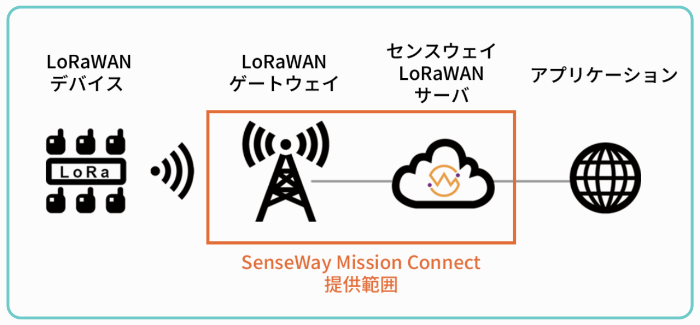
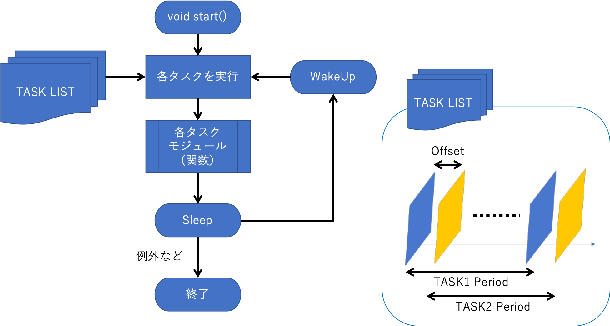

# センスウェイさんのLoRaWANスターターキットを試してみた

Getting start the Senseway LoRaWAN Starter Kit

こんにちは．最近修論をどうにかやっつけたtokina(himitu)です．今回はセンスウェイさんにLoRaWANスターターキットを頂いたので，その紹介をしたいと思います．

**長いので記事を分けました．センサ値取得とか具体的な話は次の記事を見てください**

//続きかいたらここに貼るよ

HIRATA Kenjiさん（@field_k），ありがとうございます！

https://www.senseway.net

私はLoRa/LoRaWANの研究をしており，理解しきれていない部分もあり，いまでも勉強中の身です．最近OpenwaveさんのDragino LoRaモジュールをいじったりしていました．

ではまず，入手した経緯から．

//目次

## きっかけ

昨年**「IoTつくるよ！」**というIoTのプチ博覧会のようなイベントにてアールエスコンポーネンツさんのお仕事を手伝いました．


https://www.tsukuruyo.net

アールエスコンポーネンツ（RS Components）社は電子部品の販売代理店で，Raspberry Piの正規代理店でもあります．もしかしたらロゴをみなことがあるかもしれません．

https://jp.rs-online.com/web/

実は私はアールエスコンポーネンツのブランドである「DesignSpark」にて記事を書いたり翻訳したりしています．

そんなこんなで，IoTつくるよ！にてお手伝いさせていただいていたのですが，アールエスコンポーネンツさんのブースの近くにセンスェイさんがいました（なおとなりはDoroneのOS開発をされているDoCoJAのブースでした）．

このとき数週間前からLoRaWANのサービスを提供しているというセンスェイさんについてはTwitterで目にしていました．

https://twitter.com/sensewaycorp

IoTつくるよ！にセンスェイさんがいるのは当日，開始時間になってから知りました．

これがきっかけとなり，スターターキットをいただくことになりました．それが昨年末のことです（あれから研究をずっとやっていました）．


## LoRaWANスターターキット

LoRaとLoRaWANの違いについては無限回述べているので今回は簡単に．

LoRaはSemtech社が開発している無線の変調方式で，LoRaWANはSemtech社含むLoRa Allianceが公開するLoRa無線を利用した全体のシステムを表しています（昔はMAC層以上のプロトコルを指していたこともある？）．

センスウェイさんが提供しているLoRaWANサービスはSenseWay Mission Connectと呼ばれているIoT通信プラットフォームです，



https://www.senseway.net より

LoRaWANデバイスのデータを収集，デバイスを管理する総合的なプラットフォームです．

スターターキットには以下のものが含まれていました．なお，スターターキットの購入案内ページはこちらです．

https://store.senseway.net/items/14939967

- Arduino Uno互換機
- LoRa (WAN)通信モジュール
  - LoRaアンテナ（800MHz ~ 1kHz向け？）
  - USB-Bケーブル
- LoRaWAN屋内用ゲートウェイ
  - アンテナ
  - Mini USBケーブル
  - USB変換アダプタ
  - LANケーブル
- 温度センサ（ADT7410）


実際のLoRaノード（デバイス）はこちら．アンテナがごつい！


## 試してみた

実際に試してみたので，簡単に何ができそうかまとめてみます．

一応参考にした資料は有償であるキットに含まれているので，具体的な手順については言及しないことにします．

### Senseway Mission Connect

センスウェイさんが提供するLoRaWANサービスの名称が「Senseway Mission Connect」です．

ここでデバイスの登録などができます．


まず，このデバイス管理のところへキットに入っているLoRaノードのDevEUIを追加します．Dev EUIはLoRaWANにおいてデバイスを識別するためのIDで，他のサービスでもこれは必要になってきます．

また，今回はPINコードも必要でした．これをなくすとまずいですね．

これで入手したデバイスのActivationはできたようです．

### LoRaWANゲートウェイの用意

ここまでで入手したデバイスと，LoRaWANゲートウェイ上の仮想のデバイスのリンクができたので，今度は実際のゲートウェイの準備をします．

案内されたマニュアルにはゲートウェイについては触れられていなかったので，適用に調べてこちらがヒット．

https://service.senseway.net/manual/senseway-rental-gateway-manual/

今回，私の環境ではWiFiでWANへと接続します．なお，本体にはUSB電源から電源を高級可能です．適当にそこらへんに落ちていたMini USBケーブルでつないで少し放置すると自動的に初期化が終わり，SSID：AP-XXXXXという無線LANを吹きます．なお，ここはきちんと暗号化されているので比較的安心です．

あとは上のセンスウェイさんのマニュアル通り．

なお，今回WiFiを選びましたが，もちろん使用用途によっては携帯回線とかもあると思います．ゲートウェイの設定画面では3G/4G LTEも選択可能でした．

※ここで特に受信したLoRaノードのメッセージの送信先となるLoRaWANサーバは選べないようです．多分ファームウェアレベルで書き込まれているっぽい？

うまく接続すると，webコンソールのStatus>Overviewで確認できます．DHCPでアドレスを割り当てる場合はここから確認すればいいはず．ゲートウェイ自体もAPになりますが，そっちは192.168.55.0/24で割り当てられます．

SSH接続を試みてみたところ，username/Passwordを聞かれますが，認証情報は公開されていません．Nmapすると80,22番ポートが空いていました．

### ノードのプログラミング

#### 仕様とライブラリ -KashiwaGeeks

LoRaノードはArduino Uno互換ボードとモジュールで構成されているので，Arduino Unoでプログラミングします．（今回試した私の環境ではArduino 1.8.8です）

LoRaWAN Shieldについてのマニュアルはこちら．

https://service.senseway.net/manual/senseway-lorawan-shield-for-arduino-manual/

マニュアルにはありませんでしたが，確認してみたところ，シリアルポートとはボーレート57600で通信してるっぽいです（プログラムのConsoleBegin()がSerial.begin()に相当するみたい）．

Windowsで試したのですが，ドライバの関係か，最初は認識されませんでした．なお，書き込み時のボードにはArduino/Genuino Unoを選択します．

Arduinoとモジュールとの通信はD11/D12ピンをUARTシリアルで行っているようなので，基本的にArduinoのSoftware Serialから行うことができます（D11 UART_TX，D12 UART_RX）．

しかしこれだと1からプログラミングすることになってしまうので，用意されているライブラリを使います．これには「KashiwaGeeks」というツールが利用できるそうです．

https://github.com/ty4tw/KashiwaGeeks

> LoRaWAN Application framework for Arduino.
> This framwork consists of Application,LoRaWAN devices and Payload Classes.
> These classes provide following functions:
>
> 1. Power saving with various sleep modes.
> 2. Wake up by watchdog timer.
> 3. Interrupt handling for INT0 and INT1.
> 4. Task execution control.
> 5. LoRaWAN devices control.
> 6. Allow payload to be created bit by bit.

これにより，ピン配置が正しければ問題なくLoRaモジュールを使うことができるようになります．

なお，ADB922S.cppで以下のように定義されていますね．

```c++
#define LoRa_Rx_PIN               11
#define LoRa_Tx_PIN               12
#define LoRa_WAKEUP_PIN            7
```

また，ノードのActivationの方式としてABPとOTAAという2種類があるのですが，センスウェイさんのLoRaWANサーバではOTAAのみ利用可能だそうです（最初ちょっと面倒ですが，こっちのほうがセキュアですね）．

##### KashiwaGeeksの特徴（メモ）

KashiwaGeeksをいじってて思ったこととしては，間欠動作を便利にプログラミングできるように作られていんだなということです．

全体のプログラムのイメージを簡単なフロー図にまとめてみました．



定期動作を原則とし，用意したタスクを定期実行するようです．このとき，動作時間が重ならないように気をつける必要があります．多分重なると処理に遅延が発生する原因とかになると思います．

プログラムの長さは少し冗長気味にはなりますが，わかりやすくなっています．

#### テスト

いくつかのサンプル例が用意されているので，普通に「End-node_sample」のスケッチ例から試してみました．

ソースコードはこれです．Arduino IDEでこれを書き込めば終了です．

https://github.com/ty4tw/KashiwaGeeks/tree/master/examples/End-node_Sample

書き込み成功しているようなので，Arduino IDE上からツール＞シリアルモニタをhリア気，ボーレード57600(bps)で見てみます．

```
**** End-node_Sample *****
try to join... accepted.

_/_/_/ KashiwaGeeks 0.10.3 _/_/_/


  Task1 invoked

Temperature:  1020 degrees C
%RH: 2020 %
Pressure: 5005 Pa

Send  =>lorawan tx ucnf 12 03fc07e40000138d<=

Recv  =>lorawan tx ucnf 12 03fc07e40000138d

>> Ok

>> tx_ok

> <=

 SUCCESS
LoRa sleep.
```

temperature: 1020 Degreesが気になりますが（このサンプルではセンサ値をダミーとして送信しているみたいです），とりあえずOTAAでActivationとネットワークへのJOINを行い，成功していることがわかります．次にLoRaを送信して，Ackかなにかが返ってきており，最後にスリープモードに入っていることが確認できますね．

ここでもしやと思い，webのSenseWay Mission Connectを見てみると，Uplinkのカウンタが増えています．ということは，とりあえずこれでLoRaWANサーバにデータの送信が成功していることがわかります．


私はこれでできるとは思っていなかったので驚きました．なぜなら普通はArduinoのプログラム中にDev EUIを書き込まないとLoRaWANサーバがノードを認識できない（はず）からです．なのにこうしてUplinkのカウンタが増えているこということは，ユーザが変更できない領域にDev EUIが書き込まれていることを指しているということになります．

つまり，**正規のDev EUIを書き込まれたノードじゃないと（センスウェイさんのLoRaWANサーバでは）使えない**ということです（ベンダーロックインなのでそれはそう）．

ひとまずこれで**LoRaデバイス→LoRaゲートウェイ→LoRaWANサーバ**の通信がテストできました．

ですがこれだとセンサ値とか送れてないのでセンサノードとしてはなんの意味もなしていないです．

長いので次の記事でセンサを試したことをまとめたいと思います．

## とりあえず感想

ここまでの感想としては

- 利用，テストが簡単
  - 一部ブラックボックス化されている
- GatewayのUsername/Passwordを教えてほしい
- KashiwaGeeks使ったほうがいいかも
- Dev EUI周辺がどうなっているのか全くわからない！

個人的に，LoRa無線を簡単に使うためのRadioHeadライブラリや，LoRaWANプロトコルに対応するためのLMiCライブラリ（IBMのやつ）が使えるのか気になります．書き込みだけはできるっぽい？

//頑張って書いたらここにもリンク貼ります
