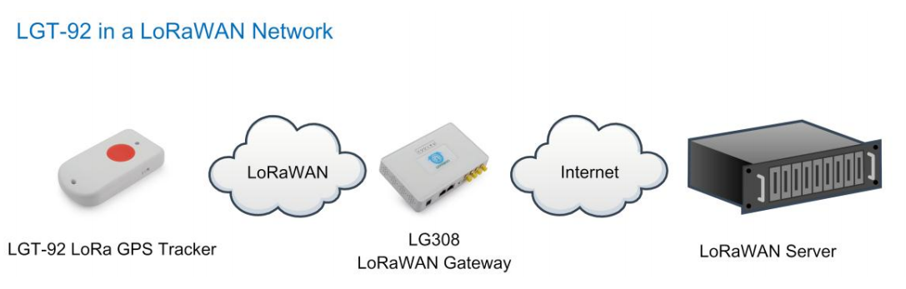
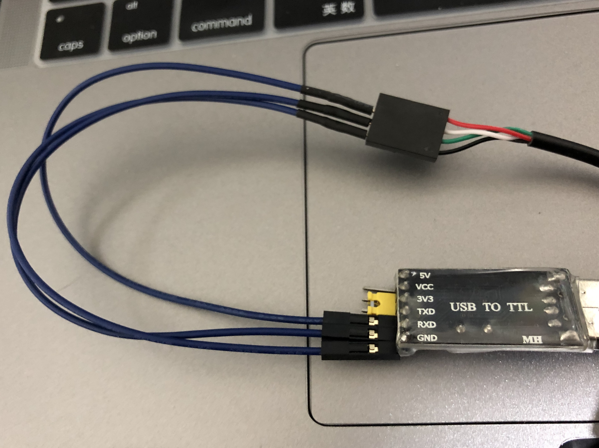
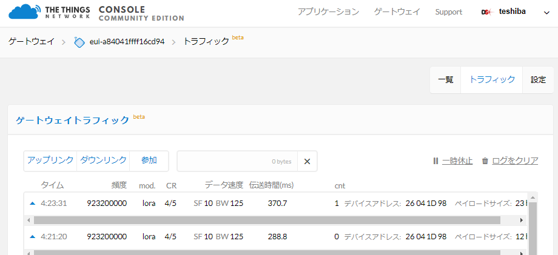
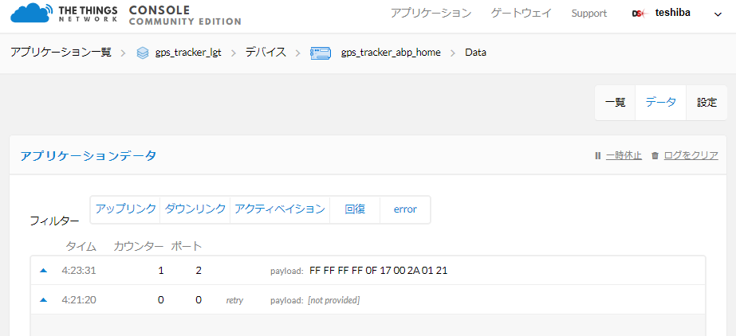

# Dragino製 LoRaWAN GPS Trackerを試してみた&設定変更手順

## TL;DR

How to configure LoRaWAN GPS Tracker (ABP to OTAA)?

というわけで、今回もLoRaWANネタです。

今回、Dragino製のLoRa  GPS Trackerを試したみたので、そのメモを残して置きたいと思います。なお、検証は電波遮断シールド下で試しています。**結果としては、上手く行かなかったので**、マニュアル実行方法などについてまとめてお後と思います。

//目次

Dragino社はLoRaデバイスを代表に、様々なIoTデバイスを取り扱っている中国深センのベンチャー企業で、そのドラゴンのアイコンが特徴です。

http://www.dragino.com/

Dragino社が提供している商品は、メイカーがプロトタイプを作成したり、メーカーのPoC作成レベルでは非常に試しやすいのが特徴です。また、LoRaデバイスも従量課金制やレンタル製ではなく、完全に買い切りで使用でき、LoRaWANではなくLoRa無線だけを利用したいユーザーもDragino製のシールドやデバイスが向いていると思います。

日本ではOpenwave社が代表してDragino製品の技適を取得しており、既にLoRa Mini Dev JPやゲートウェイ、Raspberry Pi HATが利用できます。ただ、日本で利用できるものはまだ１チャネルのもののみなので、今後に期待しています。

http://www.openwave.co.jp/

さて、昨年末、LoRaWAN GPS Trackerをある御方にお貸し頂いたのですが、２月までは修論や他のタスクで時間が取られてしまい、３月になって試してみたのですが、上手く位置情報が取れませんでした。今回は一応試してみたことについて残しておきます。

※LoRaWANやLoRa、TTN(The Things Network)については解説しません。

## Dragino製 LoRaWAN GPS Tracker(LGT-92)について

現在、入手はAliExpress経由がいいかもしれないです。ただし、ヨーロッパの技適を取得しているものの、日本での技適取得はまだなので注意してください。

https://www.aliexpress.com/item/LGT92-LoRaWAN-GPS-Tracker/32981096172.html

日本はAS923で動作しなければいけないので、ColorからAS923を選択すればOKです。

バンドについては以下参照。

```
EU433: Default frequency band EU433
CN470: Default frequency band CN470
EU868: Default frequency band EU868
IN865: Default frequency band IN865
KR920: Default frequency band KR920
AS923: Default frequency band AS923
AU915: Default frequency band AU915
US915: Default frequency band US915
```

Dragino製品としての名前はLGT-92です。

### 何ができるのか

> The Dragino LoRaWAN GPS Tracker LGT-92 is an open source GPS tracker base on Ultra Low Power STM32L072 MCU and SX1276/1278 LoRa Module.
>
> LGT-92 includes a low power GPS module L70 and 9-axis accelerometer for motion and attitude detection. The power for both of the GPS module and accelerometer can be controlled by MCU to achieve the best energy profile for different applications.

低消費電力で動作するGPSモジュールであり、その他にも9軸加速度センサを搭載しています。これらの値を定期的にLoRa無線で送信します。

公式のデータシートはこちら

<http://www.dragino.com/downloads/downloads/LGT_92/Datasheet_LGT-92.pdf

### 使い方

まず、Dragino製品の紹介ページを確認してマニュアルを参照します。

http://www.dragino.com/products/lora/item/142-lgt-92.html

ここの、以下にマニュアルが置いてあります。

http://www.dragino.com/downloads/index.php?dir=LGT_92/

まず、全体の動作概要はこんな感じです。



**動作手順**（マニュアルより）

- Step1: LoRaWANサーバー上（今回はTTN: The Things Network）でOTAA関係の鍵を作成します。
  - これに必要な情報は箱に同梱されています。
  - アプリケーションキー、各セッションキー、デバイスアドレス、デバイスEUIなどです。
- Step2: LGT-92 LoRaWAN GPS Trackerのスイッチをオンにします。
  - 本体に物理スイッチがあり、リチウムイオンバッテリーをMicroUSB経由で充電できます。
- Step3: 自動的にTTNネットワークへ参加後、定期的にサーバへ情報を送信します。


**注意**

デフォルトでは５分に一度メッセージの送信（＝位置情報の送信）を行いますが、GPSを受信する際には緑色のLEDが点灯します。一度GPS情報を受信すると、バッテリ情報、GPS情報、X軸Y軸加速度を送信します。もし2分間GPSが受信できない場合には、GPS情報を0としてメッセージを送信します。

#### TTNへのデバイス登録

TTNでアプリケーションを作成後、デバイスを登録します。アプリケーションEUIは複数設定できるので、箱に同梱されていたアプリケーションEUIをTTNコンソール上から手動で追加します。

(ABPで利用する場合)デバイスを一度作成後、設定からアクティベーション方式をOTAAからABPへ変更します。EUI関係を箱に同梱されていたものに変更します。ただし、**デバイスアドレスは変更できないため、実際のデバイスの方の設定を、TTN上で生成したアドレスに変更する必要があります**。

#### 送信メッセージのペイロードフォーマットについて

| Size(bytes) | 3        | 3         | 2       | 2       | 2       |
| ----------- | -------- | --------- | ------- | ------- | ------- |
| Value       | latitude | longitude | Battery | X accel | Y accel |

Example:
□ Latitude: 06765f ⇒ if (0x06765f & 0x800000 = 0 ): value = 0x06765f /10000 = 42.3519
□ Longitude: F2960a ⇒ if (0xF2960a & 0x800000 = 1 ):
value = (0xf2960a – 0x 1000000)/10000 -87.9094
□ BAT: Ex1: 0x0B45 ⇒ 3850mV
□ X: 04D2 = if (0x04D2 & 0x8000 = 0 ): value = 0x04D2 / 1000 = +1234 ⇒ +1.234G
□ Y: FB2E =if (0xFB2E & 0x8000 = 1 ): value =( 0xFB2E - 0x10000)/1000(dec) ⇒ -1.234G

TTNや、その他の視覚化サービスで情報を利用するにはJSON変換コードを書く必要があります。

#### ペイロード変換コードの例

以下はTTNでの変換例(マニュアル記載あり)

```json
//The function is :
function Decoder(bytes, port) {
// Decode an uplink message from a buffer
// (array) of bytes to an object of fields.
var value=bytes[0]<<16 | bytes[1]<<8 | bytes[2];
    
if(bytes[0] & 0x80)
{
value |=0xFFFFFF000000;
}
var latitude=value/10000;//gps latitude
value=bytes[3]<<16 | bytes[4]<<8 | bytes[5];
if(bytes[3] & 0x80)
{
value |=0xFFFFFF000000;
}
var longitude=value/10000;//gps longitude
value=bytes[6]<<8 | bytes[7];
var batV=value/1000;//Battery,units:V
value=bytes[8]<<8 | bytes[9];
var roll=value/100;//
value=bytes[10]<<8 | bytes[11];
var pitch=value/100;
return {
 Latitude: latitude,
 Longitud: longitude,
 Roll: roll,
 Pitch:pitch,
 BatV:batV,
 };
}
```

AllThingsTalk Makerでの変換例（ABCL）

```json
{
  "sense": [
    {
      "asset": "GPS",
      "value": {
        "type": "object",
        "propaties": {
          "latitude": {
            "type": "integer",
            "byte": 0,
            "bytelength": 3,
            "calculation": "(val / 10000)"
          },
          "longitude": {
            "type": "integer",
            "byte": 3,
            "bytelength": 3,
            "calculation": "(val / 10000)"
          },
          "altitude": {
            "type": "number"
          }
        }
      }
    },
    {
      "asset": "Battery",
      "value": {
        "type": "integer",
        "byte": 6,
        "bytelength": 2,
        "calculation": "(val / 1000)"
      }
    },
    {
      "asset": "Pitch",
      "value": {
        "type": "integer",
        "byte": 8,
        "bytelength": 2,
        "calculation": "(val / 100)"
      }
    },
    {
      "asset": "Roll",
      "value": {
        "type": "integer",
        "byte": 10,
        "bytelength": 2,
        "calculation": "(val / 100)"
      }
    }
  ]
}
```

基本的に計算方法が記載されているので、うまくリファレンス読みながら書けば問題ないはずです。

## 設定の変更方法(ABP→OTAA)

LoRaWANのノードのアクティベーション方式にはABP（Activation by Personalization）とOTAA（Over the air Activation）の2種類あります。

以下である程度詳しく解説しているので、必要に応じて参照してください。

https://www.rs-online.com/designspark/what-is-the-activation-method-on-lorawan-abp-and-otaa-jp

LoRaWAN GPS Trackerは非常にシンプルなつくりなので、OTAA方式で自動でアクティベーションされるのが理想です。よりセキュアに位置情報を送信できます。

デフォルトではOTAAで動作しますが、問題なのはLoRaゲートウェイがOTAAに対応しているかどうかです。1チャネルゲートウェイのDragino LG01, LG02, OLG01などではOTAAには対応していないので（パケットフォワーダがうまくやる例外はありますが）、ABPで利用できるようにしなければいけません（一方的にメッセージの送信を行うのでダウンリンクは関係ないため）。

まず、USB-TTLシリアルコンバータを買います。秋葉原のマルツで安く売ってたやつを買ってきました。


LoRaWAN GPS TrackerにはMicroUSBケーブル接続口しかないので、それをTTLへ変換するケーブルが同梱されています。これをつかってこんな感じで繋ぎます。

黒：GND, 緑：RXD, 白：TXD




アクセスランプが点灯すればアクセスできます。LoRaWAN GPS Trackerの電源を入れるとアクセスランプが点灯するはずです。


WindowsからはTeraTermやputtyをつかってシリアルアクセスします。今回はMacなので、/dev/配下に見えます。cuコマンドなどでアクセスします。ボーレートは9600です。

アクセスすると以下のような出力があります。

```
$ cu -l /dev/tty.usb**** -s 9600

LGT-92 Device 
Image Version: V1.3 
Frequency Band: AS923 
DevEui= AB 4e 41 ee 01 81 ge 35 
Please set the parameters or reset Device to apply change 
```

ATコマンドで設定を変更します。詳しくはマニュアルに全て記載があるので、そちらを参照してください。今回はABPへの変更手順について説明します。「#」以降はコメントです。ATコマンドは見えないので出力とは異なります。

```
LGT-92 Device 
Image Version: V1.3 
Frequency Band: AS923 
DevEui= AB 4e 41 ee 01 81 ge 35 
Please set the parameters or reset Device to apply change 

(入力)AT+FDR		#工場出荷状態へ戻す
OK				#入力に不備がある場合はERRORと出力されます

(入力)AT+NJM=0	#ABPモードへ切り替える
OK

(入力)AT+ADR=0	#Adaptive Data Rateをオフにします
OK

(入力)AT+DR=2		#データレートを指定します。マニュアルでは5になっています。
OK

(入力)AT+TDC=300000 #送信間隔を指定します
OK

(入力)AT+CHS=923200000 #送信時の周波数を指定します
OK

(入力)AT+DADDR=** ** ** ** #デバイスアドレスを指定します。スペース込みです。
OK

(入力)ATZ		#MCUをリセットする
OK

LGT-92 Device 
Image Version: VI .3 
Frequency Band: AS923 
DevEui= A8 4B 41 ee el 81 9B 35 
JOINED
```

JOINEDが表示されれば、ABPへ切り替わったことが分かります（参加フェーズがパスされています）。

これで、メッセージの送信が以下のように行われれば成功です。

```
LGT-92 Device 
Image Version: V1.3 
Frequency Band: AS923 
DevEui= AB 4e 41 ee el 81 9B 35 
JOINED 
update_times: 30
update_times: 60
update_times: 90
update_times: 110

***** UpLinkCounter= 0 *****
TX on freq 9232eeøee Hz at DR 2 
GPS NO FIX 
txDone 
rxTimeOut 
rxTimeOut 
update_times: 30
update_times: 60
update_times: 90
update_times: 110

***** UpLinkCounter=1 *****
TX on freq 9232eeeee Hz at DR 2 
GPS NO FIX 
txDone 
rx TimeOut 
rxTimeOut 
update_times: 30
update_times: 60
update_times: 90
update_times: 110
```

なお、GPSが取得できると、たまに以下のように情報が表示される場合もありますが、このあとデバイスが動作を停止してしまうので再現性がありませんでした・・・。（もしかしたらファームウェアをアップデートすれば直っているかもしれません）。※ファームウェアアップデートではST Linkを使用します。

```
Roll=84  Pitch=329
South: 35.4542
East: 139.5986
```

### TTN上でメッセージの確認

ABPへの変更後、TTN上で実際にメッセージが送信されているか確認します。

今回は自身が所有・管理しているゲートウェイでLoRaメッセージを受信したので、まずはTTN上のゲートウェイからメッセージの到達を確認します。



うまくアクティベーションされているっぽいので、登録したアプリケーションのデバイスを開いてみます。



これでメッセージの送信が行われていることが分かり、正しくアクティベーションは通っている（＝デバイスが送信したデータが復号されていることが分かります）。

しかし、payloadの部分に「FF FF FF FF 0F 17 00 2A 01 21」とあるように、GPSの情報はFFで埋められており、実際に送信できていませんでした。おそらく、バッテリと加速度の情報は送信できているようです。さらに、よく見ると11バイトです。もともと12バイトなので、変換コードがエラーを吐いて動かない可能性もあります（AllthingsTalkではエラーになっていました）。

## 正常に動作しない・・・

正常に動作しませんでした（結論）。

メッセージの送信はうまく行われているのですが、

## 最後に

今回お借りしたLoRaWAN GPS Trackerはかなり初期のものだった可能性があります。そのため、ファームウェアが古く、挙動がおかしかったのかもしれません。今回は位置情報は取得できなかったもののアクティベーションからメッセージの送信まではうまくいいきました。

非常にコンパクトで、なおかつ低消費電力で位置情報を送信できるGPS Trackerは人の流動管理などで非常に有益そうです。そのためにも、もっとLoRaWANのゲートウェイを増やしていく必要がありますね。ユースケースとしては、従業員につけて実際に仕事しているかの確認や、また動物につけてその生態を探るなどでしょうか。

なお、今回LoRaWAN GPS Trackerをお借りしたのはThe Things Networkアンバサダーの吉田さんです。以下は吉田さんのwebサイトです。最新のLoRaWAN情報をチェックできます！

http://joomlaweb.blog117.fc2.com

今年の1月末〜2月頭に開催されたThe Things ConferenceでもGPS Tracker（おそらくDragino製のものではない）をAzure Central Bridgeで可視化するデモもありました。

https://azure.microsoft.com/en-us/blog/the-things-network-and-azure-iot-connect-lorawan-devices/


今後のLoRaWANの日本での発展に私も少しでも貢献できればと思っています！

また、LoRaWAN GPS Trakcerはお返しすることになっているので、気が向いたら自分でも購入してまた試してみたいです（個人的にAzureを使って可視化してみたい）。